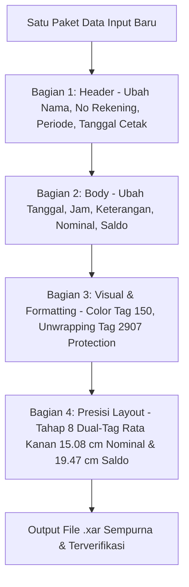

# MASTER KNOWLEDGE BASE: Prosedur Lengkap Perubahan Isi (End-to-End Content Modification), Histori Error & Solusi, serta Hasil Training Manipulasi Dokumen Biner Xara (.xar)

Document Version: 3.0  
Status: Master Reference & Standard Operating Procedure (SOP)  
Target Environment: Xara Designer Pro+ Binary Format (`.xar`)  

---

## I. HAKIKAT & ALUR PROSEDUR (END-TO-END CONTENT MODIFICATION)

Inti utama dari seluruh Prosedur (Tahap 1 s.d. 8) adalah **melakukan eksekusi perubahan isi dokumen secara menyeluruh dari atas ke bawah (*End-to-End Content Transformation*)**, mulai dari Identitas Nasabah hingga Angka Nominal & Saldo akhir, dengan tetap mempertahankan presisi layout dan acuan ruler awal.

---

## II. RINCIAN ALUR PERUBAHAN ISI DOKUMEN (TAHAP 1 HINGGA TAHAP 8)

### 1. PERUBAHAN ISI HEADER (METADATA & IDENTITAS NASAHAH)
* **Penyuntingan Nama Nasabah (`Nama/Name`)**: Mengubah nama pemilik rekening secara konsisten pada seluruh halaman (misal: `ASEP ISKANDAR`).
* **Penyuntingan Nomor Rekening (`Account Number`)**: Mengubah 13-digit nomor rekening nasabah.
* **Penyuntingan Periode Laporan (`Periode/Period`)**: Mengubah rentang tanggal laporan transaksi (misal: `01 Jan 2026 - 31 Jan 2026`).
* **Penyuntingan Tanggal Cetak & Cabang**: Mengubah tanggal cetak (`Dicetak pada/Issued on`) dan nama cabang penerbit (`Cabang/Branch`).
* **Penyuntingan Penomoran Halaman**: Mengubah penomoran halaman dinamis (`Page X of Y` / `X dari Y`).

### 2. PERUBAHAN ISI BODY (RINCIAN TRANSAKSI & ANGKA)
* **Penyuntingan Tanggal & Timestamp Jam**: Mengubah tanggal dan jam transaksi (contoh: `25 Jan 2026 14:45:12 WIB`).
* **Penyuntingan Keterangan / Deskripsi Transaksi**: Mengubah teks jenis transaksi (Transfer BI Fast, QRIS Livin, Penarikan ATM, Transfer Bank).
* **Penyuntingan Angka Nominal Transaksi**:
  * Transaksi Masuk (Kredit): Diawali tanda `+` (misal `+4.860.206,00`).
  * Transaksi Keluar (Debit): Diawali tanda `-` (misal `-1.000.000,00`).
* **Penyuntingan Angka Saldo Akhir (*Running Balance*)**: Menghitung dan memasukkan nilai saldo kumulatif setelah tiap transaksi.

### 3. PENGUNCIAN FORMATTING & RATA KANAN PRESISI
* **Penerapan Warna Automatic (`Tag 150`)**:
  * Hijau `#00A651` (`f0030000`) untuk Nominal Kredit `+`
  * Gelap `#333333` (`61020000`) untuk Nominal Debit `-`
  * Biru `#005B9C` (`4a040000`) untuk Saldo
* **Penguncian Matriks Rata Kanan Presisi (Tahap 8 SOP Lock)**:
  * Menggunakan koordinat referensi awal (*ground truth*) dari file backup:
    * **Nominal Baseline**: **$15,08\text{ cm}$** ($427.390\text{ millipoints}$)
    * **Saldo Baseline**: **$19,47\text{ cm}$** ($551.837\text{ millipoints}$)
  * Menghitung $X_{left\_new} = X_{right\_target} - (\text{Jumlah Karakter Baru} \times 0,177\text{ cm})$.
  * Memperbarui **`Tag 2100` (`TAG_MATRIX`)** dan **`Tag 2206` (`TAG_TEXT_KERN_X_Y`)** secara berpasangan.

---

## III. MATRIKS HISTORI ERROR, AKIBAT & SOLUSI TERUJI

| No | Gejala / Error | Penyebab Utama (*Root Cause*) | Solusi Teruji & Prosedur |
| :--- | :--- | :--- | :--- |
| **1** | **Teks Angka Menjadi Rata Kiri / Ujung Kanan Tidak Sejajar** | Mengubah teks tanpa menyesuaikan koordinat jangkar $X_{left}$ secara dinamis berdasarkan panjang string baru. | Terapkan **Tahap 8**: Hitung $X_{left\_new} = X_{right\_target} - (\text{Len} \times 0.177\text{ cm})$ lalu update `Tag 2100` dan `Tag 2206`. |
| **2** | **Nilai `X: ... cm` di Toolbar Atas Xara GUI Tidak Berubah / Berbeda dengan Render Visual** | Hanya meng-update `Tag 2206` (kerning) tanpa memperbarui `Tag 2100` (`TAG_MATRIX`). | Update berpasangan (*Dual-Tag Synchronization*): **`Tag 2100`** dan **`Tag 2206`** wajib di-update bersamaan. |
| **3** | **Font Ter-reset Menjadi `PDF-PDF-PDF-PDF-PD` / Warning Dialog Saat File Dibuka** | Mengubah record `Tag 2907` (`b7010000`) pada node definisi font dokumen. | Dilarang menyentuh `Tag 2907` pada node definisi font. Cukup ganti string `Tag 2207/2208/2209` dan warna `Tag 150`. |
| **4** | **Pergeseran Masal Kolom Saldo / Nominal (*Mass Shift*)** | Tidak mengisolasi dan menyimpan posisi koordinat referensi awal (*ground truth*) dari file backup sebelum melakukan edit. | **Wajib ekstraksi awal**: Baca koordinat $X_{right}$ dari `test_X.X.X_BACKUP_BEFORE_TAHAP7.xar` sebagai acuan mutlak sebelum edit. |
| **5** | **Angka 9 Berubah Menjadi Karakter Aneh / Rusak** | Karakter `9` pada encoding tertentu atau kerning individual offset corrupt. | Gunakan penulisan string UTF-16LE murni (`b'\x39\x00'`) dan perbarui payload string secara bersih via `XarDocument` DOM. |
| **6** | **Wrapping Teks Otomatis (Teks Bertingkat Dua Line)** | Karakter koma `,` atau spasi memicu pembagian kata (*word wrap*) pada container teks pendek. | Lakukan *unwrapping* (hilangkan line break / kerning Y vertikal) dan pastikan lebar container mencukupi. |

---

## IV. VERIFIKASI & METODE PENGUJIAN

SETIAP PERUBAHAN HARUS DIREVIEW DENGAN DUAL-STEP VERIFICATION:
1. **Biner DOM Verification Script**: Menjalankan script Python yang memvalidasi bahwa seluruh record `Tag 2100`, `Tag 2206`, dan `Tag 2208` mengembalikan status `100% OK`.
2. **GUI Ruler Verification**:
   * Tutup dokumen aktif di Xara Designer Pro+ (`Ctrl + W`).
   * Buka file `.xar` hasil update.
   * Tekan `Ctrl + R` (Show Rulers) untuk memastikan batas kanan angka Nominal mengunci di **$15,08\text{ cm} / 15,18\text{ cm}$** dan Saldo mengunci di **$19,47\text{ cm}$**.
