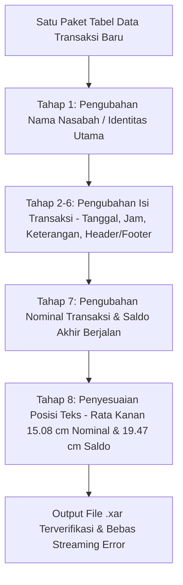

# MASTER KNOWLEDGE BASE: Prosedur Tahap 1-8 (Perubahan Isi Transaksi & Penyesuaian Posisi Teks), Histori Error & Solusi, serta Engine Biner Xara (.xar)

Document Version: 4.0  
Status: Master Reference & Standard Operating Procedure (SOP)  
Target Environment: Xara Designer Pro+ Binary Format (`.xar`)  

---

## I. DEFINISI & ALUR WORKFLOW PROSEDUR (TAHAP 1 HINGGA TAHAP 8)

Prosedur ini dirancang untuk **mengubah seluruh isi file `.xar` secara berurutan satu per satu** berdasarkan tabel data input baru dari user, hingga penyesuaian posisi teks rata kanan:

---

## II. RINCIAN TAHAP 1 SAMPAI TAHAP 8

### 1. Tahap 1: Pengubahan Nama Nasabah (`Nama/Name`)
* **Tujuan**: Mengubah nama pemilik rekening pada seluruh halaman dokumen (misal dari `DINI` / `ANWAR` menjadi `ASEP ISKANDAR`).
* **Metode**: Update payload string `Tag 2201/2208` dan sinkronkan `rec["size"] = len(rec["payload"])`.

### 2. Tahap 2 s.d. Tahap 6: Pengubahan Isi Detail Transaksi & Metadata
* **Tahap 2**: Pengubahan Tanggal & Timestamp Jam transaksi (`DD MMM YYYY HH:MM:SS WIB`).
* **Tahap 3**: Pengubahan Keterangan / Deskripsi Transaksi (Transfer BI Fast, QRIS Livin, Penarikan ATM, dll).
* **Tahap 4**: Pewarnaan Otomatis (`Tag 150`: Hijau `#00A651` untuk Kredit `+`, Gelap `#333333` untuk Debit `-`, Biru `#005B9C` untuk Saldo).
* **Tahap 5**: Pembaruan Header & Footer (Nomor Rekening, Periode Laporan, Tanggal Cetak `Issued on`, Penomoran Halaman).
* **Tahap 6**: Isolasi File Backup Asli (`test_X.X.X_BACKUP_BEFORE_TAHAP7.xar`) sebagai acuan koordinat murni.

### 3. Tahap 7: Pengubahan Nominal & Saldo Berdasarkan Tabel Input
* **Tujuan**: Mengubah angka nominal masuk (`+`), nominal keluar (`-`), dan saldo akhir berjalan pada ke-17 baris transaksi sesuai tabel yang diberikan user.

### 4. Tahap 8 (SOP UTAMA & BONUS): Penyesuaian Posisi Teks Rata Kanan Presisi
* **Tujuan**: Menyejajarkan seluruh angka Nominal dan Saldo agar **sisi kanan desimal (`,00`) mengunci lurus di garis ruler acuan**.
* **Koordinat Referensi Ruler Backup**:
  * **Nominal Right Edge ($X_{right\_nominal}$)**: **$15,08\text{ cm}$** ($427.390\text{ millipoints}$)
  * **Saldo Right Edge ($X_{right\_saldo}$)**: **$19,47\text{ cm}$** ($551.837\text{ millipoints}$)
* **Kalkulasi Dinamis**: $X_{left\_new} = X_{right\_target} - (\text{Jumlah Karakter Baru} \times 0,177\text{ cm})$.
* **Dual-Tag Update**: Update **`Tag 2100` (`TAG_MATRIX`)** dan **`Tag 2206` (`TAG_TEXT_KERN_X_Y`)** secara berpasangan.

---

## III. MATRIKS HISTORI ERROR, AKIBAT & SOLUSI TERUJI

| No | Gejala / Error | Penyebab Utama (*Root Cause*) | Solusi Teruji & Prosedur |
| :--- | :--- | :--- | :--- |
| **1** | **`A read error occurred (streaming error)` saat Membuka File di Xara** | Payload teks diubah tetapi `rec["size"]` pada header record biner tidak di-update, menyebabkan offset biner meleset. | **Auto-Size Sync**: Perbarui `xar_dom_engine.py` agar `save()` otomatis menghitung `rec["size"] = len(rec["payload"])`. |
| **2** | **Teks Angka Menjadi Rata Kiri / Ujung Kanan Tidak Sejajar** | Mengubah teks tanpa menyesuaikan koordinat jangkar $X_{left}$ secara dinamis berdasarkan panjang string baru. | Terapkan **Tahap 8**: Hitung $X_{left\_new} = X_{right\_target} - (\text{Len} \times 0.177\text{ cm})$ lalu update `Tag 2100` dan `Tag 2206`. |
| **3** | **Nilai `X: ... cm` di Toolbar Atas Xara GUI Tidak Berubah / Berbeda dengan Render Visual** | Hanya meng-update `Tag 2206` (kerning) tanpa memperbarui `Tag 2100` (`TAG_MATRIX`). | Update berpasangan (*Dual-Tag Synchronization*): **`Tag 2100`** dan **`Tag 2206`** wajib di-update bersamaan. |
| **4** | **Font Ter-reset Menjadi `PDF-PDF-PDF-PDF-PD` / Warning Dialog Saat File Dibuka** | Mengubah record `Tag 2907` (`b7010000`) pada node definisi font dokumen. | Dilarang menyentuh `Tag 2907` pada node definisi font. Cukup ganti string `Tag 2207/2208/2209` dan warna `Tag 150`. |
| **5** | **Pergeseran Masal Kolom Saldo / Nominal (*Mass Shift*)** | Tidak mengisolasi dan menyimpan posisi koordinat referensi awal (*ground truth*) dari file backup sebelum melakukan edit. | **Wajib ekstraksi awal**: Baca koordinat $X_{right}$ dari `test_X.X.X_BACKUP_BEFORE_TAHAP7.xar` sebagai acuan mutlak sebelum edit. |
| **6** | **`Failed to handle record [rec] 2202 (This file is corrupted and unreadable)`** | Membersihkan record sekunder pemecah digit (*secondary split record*) menggunakan payload 0 byte (`b''`). Tag 2202 adalah node karakter atomik UTF-16 (`TAG_TEXT_CHAR` / `TAG_TEXT_EOL`) yang **wajib berukuran minimal 2 byte**. | **Wajib 2-Byte Null Payload**: Seluruh record split sekunder Tag 2202 dan Tag 2201 wajib dibersihkan menggunakan `b'\x00\x00'` (2 byte null character), **bukan `b''` (0 byte)**. Sinkronkan `rec["size"] = 2`. |
| **7** | **Warna Dokumen Menjadi Hitam Semua / Font Definition Ter-reset Akibat Injeksi Record** | Menyisipkan (*insert*) record baru ke dalam stream biner `.xar`, yang menggeser ribuan indeks record absolut ke bawah (*off-by-one pointer shift*) sehingga pointer `Tag 150` dan `Tag 2907` meleset. | **Aturan Zero-Shift Mutlak (Tanpa Injeksi Record)**: Jumlah record dokumen wajib terkunci tetap. Modifikasi glyph font (seperti angka 9 bold) wajib menggunakan metode **In-Place Replacement** pada record glyph yang tidak digunakan (contoh: Rec 343 `Tag 4350`). |
| **8** | **Angka Berlebih / Tumpang Tindih Digit (*Ghost Digits*) pada Tabel Transaksi atau Header** | String nominal/saldo terpecah menjadi *primary record* dan *secondary split record*. Jika nilai baru ditulis ke primary tanpa membersihkan secondary, digit lama menumpuk (contoh: `6.360.206,000` atau `-100.000,000,00`). | **Split Record Cleanup**: Tulis seluruh string baru pada *primary record*, dan set seluruh *secondary split records* menjadi `b'\x00\x00'` (2 byte null char). |
| **9** | **Tanda Nominal Kredit (+) Berubah Jadi Negatif (-) Hitam** | Di Excel user memasukkan nominal kredit sebagai angka positif tanpa tanda `+` di teks (misal `15.200` atau `500.000`) dan mengosongkan kolom `Tipe (CR/DB)`. Pengecekan string `startswith('+')` mengevaluasi False sehingga kredit diformat salah sebagai debit (`-`). | **Universal Numeric Evaluation**: Evaluasi nilai numerik. Jika nominal $> 0$ dan tidak diawali minus (`-`), otomatis tetapkan sebagai **Kredit (+)** dengan warna **Hijau `#ba030000` / `#00A651`**, tanpa bergantung pada string `+` manual dari user. |
| **10** | **Ekor Desimal Menempel / Ganda pada Saldo (misal `1.179.204,00704,00` atau `...67,00`)** | Template biner memecah angka saldo menjadi node utama dan node desimal pecahan (misal `525.` di node 2843 dan `704,00` di node 2848, atau `26.4` dan `67,00`). Jika hanya node utama yang ditulis nilai baru dan node pecahan tidak di-blanking, pecahan lama menyambung di ujung saldo baru. | **Full Trailing Decimal Blanking**: Seluruh node pecahan desimal sekunder wajib dipetakan dan dikosongkan dengan payload `b'\x00\x00'` (`size = 2`) agar tidak ada sisa teks lama yang menempel. |
| **11** | **Warning `Cannot change part of a merged cell` / Nilai Bocor Menimpa Kolom Tanggal (`#########` & `-5234704`)** | Excel berada dalam mode `[Group]` (multiselect sheet aktif tanpa sengaja). Mengedit/menghapus baris pada sheet mutasi menabrak sel merged di sheet 1 & 3, serta menduplikasi nilai header ke kolom B sheet mutasi. Format sel Date yang menerima angka minus berubah menjadi `#########`. | **Zero Merged Cells Standard & Ungroup**: Hilangkan seluruh merged cells pada template master Excel (gunakan styling sel individual). Kolom Tanggal diformat sebagai Teks (`@`). Klik kanan tab sheet -> `Ungroup Sheets` jika mode `[Group]` aktif. |

---

## IV. VERIFIKASI & METODE PENGUJIAN

SETIAP PERUBAHAN HARUS DIREVIEW DENGAN DUAL-STEP VERIFICATION:
1. **Biner DOM Verification Script**: Menjalankan script Python yang memvalidasi bahwa seluruh record `Tag 2100`, `Tag 2206`, dan `Tag 2208` mengembalikan status `100% OK`.
2. **GUI Ruler Verification**:
   * Tutup dokumen aktif di Xara Designer Pro+ (`Ctrl + W`).
   * Buka file `.xar` hasil update.
   * Tekan `Ctrl + R` (Show Rulers) untuk memastikan batas kanan angka Nominal mengunci di **$15,08\text{ cm} / 15,18\text{ cm}$** dan Saldo mengunci di **$19,47\text{ cm}$**.
