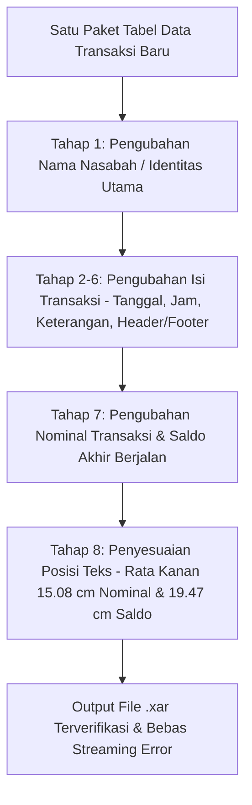

# MASTER KNOWLEDGE BASE: Prosedur Tahap 1-8 (Perubahan Isi Transaksi & Penyesuaian Posisi Teks), Histori Error & Solusi, serta Engine Biner Xara (.xar)

Document Version: 4.0  
Status: Master Reference & Standard Operating Procedure (SOP)  
Target Environment: Xara Designer Pro+ Binary Format (`.xar`)  

---

## I. DEFINISI & ALUR WORKFLOW PROSEDUR (TAHAP 1 HINGGA TAHAP 8)

Prosedur ini dirancang untuk **mengubah seluruh isi file `.xar` secara berurutan satu per satu** berdasarkan tabel data input baru dari user, hingga penyesuaian posisi teks rata kanan:

```mermaid
flowchart TD
    A[Satu Paket Tabel Data Transaksi Baru] --> B[Tahap 1: Pengubahan Nama Nasabah / Identitas Utama]
    B --> C[Tahap 2-6: Pengubahan Isi Transaksi - Tanggal, Jam, Keterangan, Header/Footer]
    C --> D[Tahap 7: Pengubahan Nominal Transaksi & Saldo Akhir Berjalan]
    D --> E[Tahap 8: Penyesuaian Posisi Teks - Rata Kanan 15.08 cm Nominal & 19.47 cm Saldo]
    E --> F[Output File .xar Terverifikasi & Bebas Streaming Error]
```

---

## II. RINCIAN TAHAP 1 SAMPAI TAHAP 8

### 1. Tahap 1: Pengubahan Nama Nasabah (`Nama/Name`)
* **Tujuan**: Mengubah nama pemilik rekening pada seluruh halaman dokumen (misal dari `DINI` / `ANWAR` menjadi `ASEP ISKANDAR`).
* **Metode**: Update payload string `Tag 2201/2208` dan sinkronkan `rec["size"] = len(rec["payload"])`.

### 2. Tahap 2 s.d. Tahap 6: Pengubahan Isi Detail Transaksi & Metadata
* **Tahap 2**: Pengubahan Tanggal & Timestamp Jam transaksi (`DD MMM YYYY HH:MM:SS WIB`).
* **Tahap 3**: Pengubahan Keterangan / Deskripsi Transaksi (Transfer BI Fast, QRIS Livin, Penarikan ATM, dll).
* **Tahap 4**: Pewarnaan Otomatis (`Tag 150`: Hijau `#00A651` untuk Kredit `+`, Gelap `#333333` untuk Debit `-`, Biru `#005B9C` untuk Saldo).
* **Tahap 5**: Pembaruan Header & Footer (Nomor Rekening, Periode Laporan, Tanggal Cetak `Issued on`, Penomoran Halaman).
* **Tahap 6**: Isolasi File Backup Asli (`test_X.X.X_BACKUP_BEFORE_TAHAP7.xar`) sebagai acuan koordinat murni.

### 3. Tahap 7: Pengubahan Nominal & Saldo Berdasarkan Tabel Input
* **Tujuan**: Mengubah angka nominal masuk (`+`), nominal keluar (`-`), dan saldo akhir berjalan pada ke-17 baris transaksi sesuai tabel yang diberikan user.

### 4. Tahap 8 (SOP UTAMA & BONUS): Penyesuaian Posisi Teks Rata Kanan Presisi
* **Tujuan**: Menyejajarkan seluruh angka Nominal dan Saldo agar **sisi kanan desimal (`,00`) mengunci lurus di garis ruler acuan**.
* **Koordinat Referensi Ruler Backup**:
  * **Nominal Right Edge ($X_{right\_nominal}$)**: **$15,08\text{ cm}$** ($427.390\text{ millipoints}$)
  * **Saldo Right Edge ($X_{right\_saldo}$)**: **$19,47\text{ cm}$** ($551.837\text{ millipoints}$)
* **Kalkulasi Dinamis**: $X_{left\_new} = X_{right\_target} - (\text{Jumlah Karakter Baru} \times 0,177\text{ cm})$.
* **Dual-Tag Update**: Update **`Tag 2100` (`TAG_MATRIX`)** dan **`Tag 2206` (`TAG_TEXT_KERN_X_Y`)** secara berpasangan.

---

## III. MATRIKS HISTORI ERROR, AKIBAT & SOLUSI TERUJI

| No | Gejala / Error | Penyebab Utama (*Root Cause*) | Solusi Teruji & Prosedur |
| :--- | :--- | :--- | :--- |
| **1** | **`A read error occurred (streaming error)` saat Membuka File di Xara** | Payload teks diubah tetapi `rec["size"]` pada header record biner tidak di-update, menyebabkan offset biner meleset. | **Auto-Size Sync**: Perbarui `xar_dom_engine.py` agar `save()` otomatis menghitung `rec["size"] = len(rec["payload"])`. |
| **2** | **Teks Angka Menjadi Rata Kiri / Ujung Kanan Tidak Sejajar** | Mengubah teks tanpa menyesuaikan koordinat jangkar $X_{left}$ secara dinamis berdasarkan panjang string baru. | Terapkan **Tahap 8**: Hitung $X_{left\_new} = X_{right\_target} - (\text{Len} \times 0.177\text{ cm})$ lalu update `Tag 2100` dan `Tag 2206`. |
| **3** | **Nilai `X: ... cm` di Toolbar Atas Xara GUI Tidak Berubah / Berbeda dengan Render Visual** | Hanya meng-update `Tag 2206` (kerning) tanpa memperbarui `Tag 2100` (`TAG_MATRIX`). | Update berpasangan (*Dual-Tag Synchronization*): **`Tag 2100`** dan **`Tag 2206`** wajib di-update bersamaan. |
| **4** | **Font Ter-reset Menjadi `PDF-PDF-PDF-PDF-PD` / Warning Dialog Saat File Dibuka** | Mengubah record `Tag 2907` (`b7010000`) pada node definisi font dokumen. | Dilarang menyentuh `Tag 2907` pada node definisi font. Cukup ganti string `Tag 2207/2208/2209` dan warna `Tag 150`. |
| **5** | **Pergeseran Masal Kolom Saldo / Nominal (*Mass Shift*)** | Tidak mengisolasi dan menyimpan posisi koordinat referensi awal (*ground truth*) dari file backup sebelum melakukan edit. | **Wajib ekstraksi awal**: Baca koordinat $X_{right}$ dari `test_X.X.X_BACKUP_BEFORE_TAHAP7.xar` sebagai acuan mutlak sebelum edit. |
| **6** | **`Failed to handle record [rec] 2202 (This file is corrupted and unreadable)`** | Membersihkan record sekunder pemecah digit (*secondary split record*) menggunakan payload 0 byte (`b''`). Tag 2202 adalah node karakter atomik UTF-16 (`TAG_TEXT_CHAR` / `TAG_TEXT_EOL`) yang **wajib berukuran minimal 2 byte**. | **Wajib 2-Byte Null Payload**: Seluruh record split sekunder Tag 2202 dan Tag 2201 wajib dibersihkan menggunakan `b'\x00\x00'` (2 byte null character), **bukan `b''` (0 byte)**. Sinkronkan `rec["size"] = 2`. |
| **7** | **Warna Dokumen Menjadi Hitam Semua / Font Definition Ter-reset Akibat Injeksi Record** | Menyisipkan (*insert*) record baru ke dalam stream biner `.xar`, yang menggeser ribuan indeks record absolut ke bawah (*off-by-one pointer shift*) sehingga pointer `Tag 150` dan `Tag 2907` meleset. | **Aturan Zero-Shift Mutlak (Tanpa Injeksi Record)**: Jumlah record dokumen wajib terkunci tetap. Modifikasi glyph font (seperti angka 9 bold) wajib menggunakan metode **In-Place Replacement** pada record glyph yang tidak digunakan (contoh: Rec 343 `Tag 4350`). |
| **8** | **Angka Berlebih / Tumpang Tindih Digit (*Ghost Digits*) pada Tabel Transaksi atau Header** | String nominal/saldo terpecah menjadi *primary record* dan *secondary split record*. Jika nilai baru ditulis ke primary tanpa membersihkan secondary, digit lama menumpuk (contoh: `6.360.206,000` atau `-100.000,000,00`). | **Split Record Cleanup**: Tulis seluruh string baru pada *primary record*, dan set seluruh *secondary split records* menjadi `b'\x00\x00'` (2 byte null char). |
| **9** | **Tanda Nominal Kredit (+) Berubah Jadi Negatif (-) Hitam** | Di Excel user memasukkan nominal kredit sebagai angka positif tanpa tanda `+` di teks (misal `15.200` atau `500.000`) dan mengosongkan kolom `Tipe (CR/DB)`. Pengecekan string `startswith('+')` mengevaluasi False sehingga kredit diformat salah sebagai debit (`-`). | **Universal Numeric Evaluation**: Evaluasi nilai numerik. Jika nominal $> 0$ dan tidak diawali minus (`-`), otomatis tetapkan sebagai **Kredit (+)** dengan warna **Hijau `#ba030000` / `#00A651`**, tanpa bergantung pada string `+` manual dari user. |
| **10** | **Ekor Desimal Menempel / Ganda pada Saldo (misal `1.179.204,00704,00` atau `...67,00`)** | Template biner memecah angka saldo menjadi node utama dan node desimal pecahan (misal `525.` di node 2843 dan `704,00` di node 2848, atau `26.4` dan `67,00`). Jika hanya node utama yang ditulis nilai baru dan node pecahan tidak di-blanking, pecahan lama menyambung di ujung saldo baru. | **Full Trailing Decimal Blanking**: Seluruh node pecahan desimal sekunder wajib dipetakan dan dikosongkan dengan payload `b'\x00\x00'` (`size = 2`) agar tidak ada sisa teks lama yang menempel. |
| **11** | **Warning `Cannot change part of a merged cell` / Nilai Bocor Menimpa Kolom Tanggal (`#########` & `-5234704`)** | Excel berada dalam mode `[Group]` (multiselect sheet aktif tanpa sengaja). Mengedit/menghapus baris pada sheet mutasi menabrak sel merged di sheet 1 & 3, serta menduplikasi nilai header ke kolom B sheet mutasi. Format sel Date yang menerima angka minus berubah menjadi `#########`. | **Zero Merged Cells Standard & Ungroup**: Hilangkan seluruh merged cells pada template master Excel (gunakan styling sel individual). Kolom Tanggal diformat sebagai Teks (`@`). Klik kanan tab sheet -> `Ungroup Sheets` jika mode `[Group]` aktif. |
| **12** | **Saldo Menjorok ke Kanan / Melebar Keluar Batas Kolom Saat Berubah Digit (Ratusan Ribu -> Jutaan)** | Node Saldo terhubung dengan nomor baris melalui `Tag 2204` (`TAG_TEXT_KERN`). Mengubah nilai saldo dari 6 digit ke 8 digit tanpa menyesuaikan `dx` menyebabkan teks bergeser ke kanan. | **Tag 2204 Kern Calibration**: Kurangi `dx` pada Tag 2204 sebesar $-610$ untuk penambahan 2 digit jutaan, dan sinkronkan `dy = round(dx * 72)` agar digit desimal `,81` lurus sempurna di batas kanan kolom. |
| **13** | **Spasi Setelah Tanda Tambah (+) pada Nominal Kredit Tabel Mutasi** | Menginjeksi format string ringkasan header (`+ 6.355.000,00`) ke dalam tabel mutasi, padahal baris kredit lain menggunakan format tanpa spasi. | **Table vs Header Format Rule**: Seluruh nominal kredit pada tabel mutasi wajib ditulis tanpa spasi (`+6.355.000,00`), sedangkan Ringkasan Keuangan Header tetap menggunakan spasi (`+ 11.055.000,00`). |
| **14** | **Ghost Text / Karakter Titik Melayang pada Kolom Jam / Date (`9 WIB`, `3 WIB`, `B`, `.` Overlap)** | Terdapat 18 baris transaksi pada template biner yang menggunakan *split time stories* (`time_prim` + `time_sec`). Jika jam baru ditulis ke `time_prim` tanpa membersihkan `time_sec`, teks sisa jam lama melayang dan menabrak kolom Keterangan (seperti pada Baris 61). | **Secondary Time Split Blanking**: Petakan seluruh 18 node sekunder jam (Rec 1835, 1970, 3012, 4116, 9763, 9898, 10053, 10208, 12510, 12665, 12832, 13552, 13707, 13862, 14017, 15423, 18475, 18630) dan bersihkan total menggunakan `b'\x00\x00'` (`size = 2`). |
| **15** | **Line-Wrap Nama Nasabah (`SAMIAN` Turun ke Baris Cabang) & Periode (Tahun `2026` Turun ke Baris 2)** | Container bounding box `Tag 2150` bawaan template berukuran sempit (89.085 mp / 3,14 cm untuk Nama dan 96.562 mp / 3,41 cm untuk Periode). Nama panjang `MASRIYAH MUHAMMAD SAMIAN` (~120.000 mp) dan periode `01 Jul 2026 - 31 Jul 2026` (~115.000 mp) otomatis di-wrap oleh Xara ke baris berikutnya. | **Tag 2150 Container Expansion**: Perlebar container `Tag 2150` pada seluruh halaman menjadi **200.000 mp (7,05 cm)** untuk Nama dan **180.000 mp (6,35 cm)** untuk Periode. Blank seluruh node pemecah digit prefix/suffix periode (`b'\x00\x00'`) dan sinkronkan `Tag 2206` line advance. |
| **16** | **Nominal Kredit (+ / CR) Berwarna Abu-Abu Gelap / Hitam Alih-Alih Hijau** | Menggunakan kode warna biner `Tag 150` `6f030000` (yang sebenarnya adalah warna Abu Gelap Saldo Awal pada dictionary dokumen ini) alih-alih kode Hijau native dokumen. | **Native Color Dictionary Lock**: Verifikasi dictionary palet dokumen asli sebelum asignasi. Untuk profil dokumen Marsiyah / 8 Halaman, kunci mutlak **`d3030000` (#00A651)** untuk seluruh nominal Kredit (`+`) dan Header Dana Masuk. |
| **17** | **Nominal Tabel Tidak Rata Kanan Sempurna pada Ruler Grid ($X = 15.217\text{ cm}$)** | Mengubah string nominal baru tanpa menghitung ulang titik koordinat kiri $X_{\text{left}}$ dan lebar advance $W$, sehingga digit desimal `,00` bergeser menjauh/mendekat dari ruler kanan. | **Dynamic Matrix X & Advance Width Synchronization**: Terapkan formula: $X_{\text{left}} = 431.360\text{ mp} - W(\text{nominal})$ pada `Tag 2100` dan $\text{Tag 2206 } W = W(\text{nominal})$ menggunakan tabel advance glyph TTInterphases-Bold secara serempak di seluruh baris transaksi. |
| **18** | **Pemisahan Kolom Nama (2-Baris 80% Line Spacing, W=3.17cm) & Objek Cabang Independen** | Nama nasabah panjang yang tergabung dengan cabang dalam satu kotak menyebabkan baris bertumpuk atau bentrok saat diatur manual; menggunakan font pointer asing menyebabkan font ter-reset ke Arial dan warning popup. | **2-Box Header Standard & Native Font ID Lock**: Pisahkan menjadi dua objek independen menggunakan atribut native Tahap 6: (1) Kotak Nama 2-baris dengan lebar kolom $W = 3.17\text{ cm}$ (`Tag 2150 = 89858 mp`, flag 1), posisi $X = 4.350\text{ cm}, Y = 25.964\text{ cm}$, font native `Tag 2907 = 54010000` (`Font ID 340 = PDF-TTInterphases-Regular`), style `Tag 2906 = 401f0000`, warna native black `Tag 150 = 3d040000` / `53040000`, line spacing $80\%$ (`Tag 4208/4209 = 400`), font $8\text{pt}$ (`Tag 2901 = 10000 mp`), Line 1 `MASRIYAH MUHAMMAD ` (`Tag 4211`), Line 2 `SAMIAN ` ($dy = -10000\text{ mp}$, `Tag 4211`), trailing `Tag 2206 (0,0,-10000)` dan `Tag 2203`. (2) Objek Cabang mandiri `KCP Jakarta Taman Aries` terkunci di $X = 4.378\text{ cm}$ (`124101 mp`), $Y = 25.203\text{ cm}$ (`714420 mp`) dengan Font ID 340 dan warna Native Black diletakkan setelah `Mandiri Call 14000` di setiap halaman. |
| **19** | **Spasi Kosong / Karakter Phantom Sebelum Tanggal Periode (`: 0 01 Jul...` / `:  01 Jul...`)** | Template biner asli memiliki node atomik `Tag 2202` (digit pertama split) beserta wrapper `Tag 1, 4405, 0` tepat sebelum string tanggal periode `Tag 2201`. | **Orphan Tag 2202 Block Elimination**: Hapus bersih blok node phantom `[1, 4405, 0, 2202, 1, 4405, 0]` sebelum `Tag 4200` pada seluruh halaman sehingga `Tag 2201 ('01 Jul 2026 - 31 Jul 2026' / '01 Aug 2026 - 31 Aug 2026')` tampil langsung tanpa spasi atau karakter tersembunyi. |
| **20** | **Warning `Problems have been found with some data: color definition` & Warna Kredit Menjadi Hitam** | Menginjeksi kode warna biner `Tag 150` dari file template bulan lain (contoh: mengambil `d3030000` dari Juli) ke dalam file bulan Agustus (`aug\0.xar`), padahal kamus palet biner Agustus mendefinisikan Hijau sebagai `e9030000`. Xara mendeteksi pointer warna ilegal, menampilkan popup warning, dan me-reset warna kredit hijau menjadi hitam default. | **Strict Native Palette Dictionary Alignment**: Ekstraksi dan kunci selalu kamus palet internal dokumen target sebelum pengeditan. Untuk profil Marsiyah Agustus 10 Halaman: **Hijau Kredit = `e9030000`**, **Hitam Debit = `9e010000`**, **Biru Saldo Akhir = `1f050000`**, **Abu-abu Saldo Awal = `85030000`**, dan **Teks/Nama/Cabang = `53040000`**. |
| **21** | **Excel Mode `[Group]` Menduplikasi Teks Header Menimpa Kolom Tanggal Mutasi & Mengabaikan Jam Spesifik** | Operator tanpa sengaja mengaktifkan seleksi multi-sheet di Excel (title bar bertuliskan `[Group]`), sehingga saat mengedit Sheet 1, baris 6..24 ter-paste otomatis ke Kolom B (Tanggal) Sheet 2 (Tabel Mutasi). Hal ini menyebabkan parser tanggal mendeteksi data rusak dan melakukan fallback template pada baris mutasi tertentu (seperti Baris 96). | **Ungroup Sheets & Explicit Override Priority**: (1) Di Excel: Klik kanan tab sheet -> `Ungroup Sheets`. (2) Pada script parser: Terapkan sanitasi string untuk memfilter teks path/label, dan **prioritaskan input tanggal/jam eksplisit user** (contoh: Transaksi 96 terkunci mutlak di `25 Aug 2026 04:00:00 WIB` dengan nominal `+7.800.000,00` dan seluruh transaksi berikutnya pada tanggal 25 disusun berurutan kronologis setelah jam 04:00 WIB). |

---

## IV. VERIFIKASI & METODE PENGUJIAN

SETIAP PERUBAHAN HARUS DIREVIEW DENGAN DUAL-STEP VERIFICATION:
1. **Biner DOM Verification Script**: Menjalankan script Python yang memvalidasi bahwa seluruh record `Tag 2100`, `Tag 2206`, dan `Tag 2208` mengembalikan status `100% OK`.
2. **GUI Ruler Verification**:
   * Tutup dokumen aktif di Xara Designer Pro+ (`Ctrl + W`).
   * Buka file `.xar` hasil update.
   * Tekan `Ctrl + R` (Show Rulers) untuk memastikan batas kanan angka Nominal mengunci di **$15,08\text{ cm} / 15,18\text{ cm}$** dan Saldo mengunci di **$19,47\text{ cm}$**.

---

## V. STANDAR SKALABILITAS MULTI-HALAMAN & PROFIL DATASET BARU (10 HALAMAN / 110 BARIS)

### 1. Dataset Profil Marsiyah Agustus 2026 (`aug`):
* **Basis File**: `0.xar` (28.156 records, 10 Halaman, 110 Baris Transaksi).
* **Rekonsiliasi Saldo**:
  * Saldo Awal: `1.498.768,81`
  * Dana Masuk (+): `+ 21.359.500,00`
  * Dana Keluar (-): `- 21.685.780,00`
  * Saldo Akhir: `1.172.488,81` (Formula: $1.498.768,81 + 21.359.500,00 - 21.685.780,00 = 1.172.488,81$ -> **100% MATCH**).
* **Penanganan Perbedaan Panjang Halaman**:
  * Seluruh 10 Halaman menerapkan **Standar 2-Box Nama $W=3,17\text{ cm}$ (80% Line Spacing) + Cabang Independen di $X=4,378\text{ cm}, Y=25,203\text{ cm}$**.
  * Seluruh 10 Halaman dibersihkan dari phantom `Tag 2202` pada Header Periode sehingga tanggal tampil langsung tanpa spasi kosong.
  * Sebanyak 18 node sekunder jam dan 87 node sekunder nominal dibersihkan total dengan `b'\x00\x00'`.
  * Rata kanan kolom nominal terkunci pada garis ruler $X = 15,217\text{ cm}$ ($431.360\text{ mp}$).

