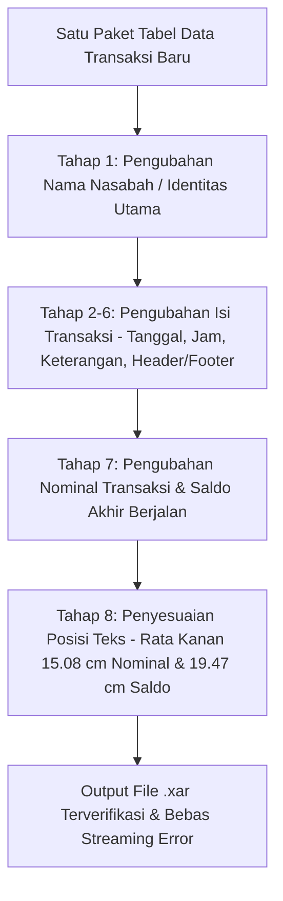

# MASTER KNOWLEDGE BASE: Prosedur Tahap 1-8 (Perubahan Isi Transaksi & Penyesuaian Posisi Teks), Histori Error & Solusi, serta Engine Biner Xara (.xar)

Document Version: 4.0  
Status: Master Reference & Standard Operating Procedure (SOP)  
Target Environment: Xara Designer Pro+ Binary Format (`.xar`)  

---

## I. DEFINISI & ALUR WORKFLOW PROSEDUR (TAHAP 1 HINGGA TAHAP 8)

Prosedur ini dirancang untuk **mengubah seluruh isi file `.xar` secara berurutan satu per satu** berdasarkan tabel data input baru dari user, hingga penyesuaian posisi teks rata kanan:

```mermaid
flowchart TD
    A[Satu Paket Tabel Data Transaksi Baru] --> B[Tahap 1: Pengubahan Nama Nasabah / Identitas Utama]
    B --> C[Tahap 2-6: Pengubahan Isi Transaksi - Tanggal, Jam, Keterangan, Header/Footer]
    C --> D[Tahap 7: Pengubahan Nominal Transaksi & Saldo Akhir Berjalan]
    D --> E[Tahap 8: Penyesuaian Posisi Teks - Rata Kanan 15.08 cm Nominal & 19.47 cm Saldo]
    E --> F[Output File .xar Terverifikasi & Bebas Streaming Error]
```

---

## II. RINCIAN TAHAP 1 SAMPAI TAHAP 8

### 1. Tahap 1: Pengubahan Nama Nasabah (`Nama/Name`)
* **Tujuan**: Mengubah nama pemilik rekening pada seluruh halaman dokumen (misal dari `DINI` / `ANWAR` menjadi `ASEP ISKANDAR`).
* **Metode**: Update payload string `Tag 2201/2208` dan sinkronkan `rec["size"] = len(rec["payload"])`.

### 2. Tahap 2 s.d. Tahap 6: Pengubahan Isi Detail Transaksi & Metadata
* **Tahap 2**: Pengubahan Tanggal & Timestamp Jam transaksi (`DD MMM YYYY HH:MM:SS WIB`).
* **Tahap 3**: Pengubahan Keterangan / Deskripsi Transaksi (Transfer BI Fast, QRIS Livin, Penarikan ATM, dll).
* **Tahap 4**: Pewarnaan Otomatis (`Tag 150`: Hijau `#00A651` untuk Kredit `+`, Gelap `#333333` untuk Debit `-`, Biru `#005B9C` untuk Saldo).
* **Tahap 5**: Pembaruan Header & Footer (Nomor Rekening, Periode Laporan, Tanggal Cetak `Issued on`, Penomoran Halaman).
* **Tahap 6**: Isolasi File Backup Asli (`test_X.X.X_BACKUP_BEFORE_TAHAP7.xar`) sebagai acuan koordinat murni.

### 3. Tahap 7: Pengubahan Nominal & Saldo Berdasarkan Tabel Input
* **Tujuan**: Mengubah angka nominal masuk (`+`), nominal keluar (`-`), dan saldo akhir berjalan pada ke-17 baris transaksi sesuai tabel yang diberikan user.

### 4. Tahap 8 (SOP UTAMA & BONUS): Penyesuaian Posisi Teks Rata Kanan Presisi
* **Tujuan**: Menyejajarkan seluruh angka Nominal dan Saldo agar **sisi kanan desimal (`,00`) mengunci lurus di garis ruler acuan**.
* **Koordinat Referensi Ruler Backup**:
  * **Nominal Right Edge ($X_{right\_nominal}$)**: **$15,08\text{ cm}$** ($427.390\text{ millipoints}$)
  * **Saldo Right Edge ($X_{right\_saldo}$)**: **$19,47\text{ cm}$** ($551.837\text{ millipoints}$)
* **Kalkulasi Dinamis**: $X_{left\_new} = X_{right\_target} - (\text{Jumlah Karakter Baru} \times 0,177\text{ cm})$.
* **Dual-Tag Update**: Update **`Tag 2100` (`TAG_MATRIX`)** dan **`Tag 2206` (`TAG_TEXT_KERN_X_Y`)** secara berpasangan.

---

## III. MATRIKS HISTORI ERROR, AKIBAT & SOLUSI TERUJI

| No | Gejala / Error | Penyebab Utama (*Root Cause*) | Solusi Teruji & Prosedur |
| :--- | :--- | :--- | :--- |
| **1** | **`A read error occurred (streaming error)` saat Membuka File di Xara** | Payload teks diubah tetapi `rec["size"]` pada header record biner tidak di-update, menyebabkan offset biner meleset. | **Auto-Size Sync**: Perbarui `xar_dom_engine.py` agar `save()` otomatis menghitung `rec["size"] = len(rec["payload"])`. |
| **2** | **Teks Angka Menjadi Rata Kiri / Ujung Kanan Tidak Sejajar** | Mengubah teks tanpa menyesuaikan koordinat jangkar $X_{left}$ secara dinamis berdasarkan panjang string baru. | Terapkan **Tahap 8**: Hitung $X_{left\_new} = X_{right\_target} - (\text{Len} \times 0.177\text{ cm})$ lalu update `Tag 2100` dan `Tag 2206`. |
| **3** | **Nilai `X: ... cm` di Toolbar Atas Xara GUI Tidak Berubah / Berbeda dengan Render Visual** | Hanya meng-update `Tag 2206` (kerning) tanpa memperbarui `Tag 2100` (`TAG_MATRIX`). | Update berpasangan (*Dual-Tag Synchronization*): **`Tag 2100`** dan **`Tag 2206`** wajib di-update bersamaan. |
| **4** | **Font Ter-reset Menjadi `PDF-PDF-PDF-PDF-PD` / Warning Dialog Saat File Dibuka** | Mengubah record `Tag 2907` (`b7010000`) pada node definisi font dokumen. | Dilarang menyentuh `Tag 2907` pada node definisi font. Cukup ganti string `Tag 2207/2208/2209` dan warna `Tag 150`. |
| **5** | **Pergeseran Masal Kolom Saldo / Nominal (*Mass Shift*)** | Tidak mengisolasi dan menyimpan posisi koordinat referensi awal (*ground truth*) dari file backup sebelum melakukan edit. | **Wajib ekstraksi awal**: Baca koordinat $X_{right}$ dari `test_X.X.X_BACKUP_BEFORE_TAHAP7.xar` sebagai acuan mutlak sebelum edit. |
| **6** | **`Failed to handle record [rec] 2202 (This file is corrupted and unreadable)`** | Membersihkan record sekunder pemecah digit (*secondary split record*) menggunakan payload 0 byte (`b''`). Tag 2202 adalah node karakter atomik UTF-16 (`TAG_TEXT_CHAR` / `TAG_TEXT_EOL`) yang **wajib berukuran minimal 2 byte**. | **Wajib 2-Byte Null Payload**: Seluruh record split sekunder Tag 2202 dan Tag 2201 wajib dibersihkan menggunakan `b'\x00\x00'` (2 byte null character), **bukan `b''` (0 byte)**. Sinkronkan `rec["size"] = 2`. |
| **7** | **Warna Dokumen Menjadi Hitam Semua / Font Definition Ter-reset Akibat Injeksi Record** | Menyisipkan (*insert*) record baru ke dalam stream biner `.xar`, yang menggeser ribuan indeks record absolut ke bawah (*off-by-one pointer shift*) sehingga pointer `Tag 150` dan `Tag 2907` meleset. | **Aturan Zero-Shift Mutlak (Tanpa Injeksi Record)**: Jumlah record dokumen wajib terkunci tetap. Modifikasi glyph font (seperti angka 9 bold) wajib menggunakan metode **In-Place Replacement** pada record glyph yang tidak digunakan (contoh: Rec 343 `Tag 4350`). |
| **8** | **Angka Berlebih / Tumpang Tindih Digit (*Ghost Digits*) pada Tabel Transaksi atau Header** | String nominal/saldo terpecah menjadi *primary record* dan *secondary split record*. Jika nilai baru ditulis ke primary tanpa membersihkan secondary, digit lama menumpuk (contoh: `6.360.206,000` atau `-100.000,000,00`). | **Split Record Cleanup**: Tulis seluruh string baru pada *primary record*, dan set seluruh *secondary split records* menjadi `b'\x00\x00'` (2 byte null char). |
| **9** | **Tanda Nominal Kredit (+) Berubah Jadi Negatif (-) Hitam** | Di Excel user memasukkan nominal kredit sebagai angka positif tanpa tanda `+` di teks (misal `15.200` atau `500.000`) dan mengosongkan kolom `Tipe (CR/DB)`. Pengecekan string `startswith('+')` mengevaluasi False sehingga kredit diformat salah sebagai debit (`-`). | **Universal Numeric Evaluation**: Evaluasi nilai numerik. Jika nominal $> 0$ dan tidak diawali minus (`-`), otomatis tetapkan sebagai **Kredit (+)** dengan warna **Hijau `#ba030000` / `#00A651`**, tanpa bergantung pada string `+` manual dari user. |
| **10** | **Ekor Desimal Menempel / Ganda pada Saldo (misal `1.179.204,00704,00` atau `...67,00`)** | Template biner memecah angka saldo menjadi node utama dan node desimal pecahan (misal `525.` di node 2843 dan `704,00` di node 2848, atau `26.4` dan `67,00`). Jika hanya node utama yang ditulis nilai baru dan node pecahan tidak di-blanking, pecahan lama menyambung di ujung saldo baru. | **Full Trailing Decimal Blanking**: Seluruh node pecahan desimal sekunder wajib dipetakan dan dikosongkan dengan payload `b'\x00\x00'` (`size = 2`) agar tidak ada sisa teks lama yang menempel. |
| **11** | **Warning `Cannot change part of a merged cell` / Nilai Bocor Menimpa Kolom Tanggal (`#########` & `-5234704`)** | Excel berada dalam mode `[Group]` (multiselect sheet aktif tanpa sengaja). Mengedit/menghapus baris pada sheet mutasi menabrak sel merged di sheet 1 & 3, serta menduplikasi nilai header ke kolom B sheet mutasi. Format sel Date yang menerima angka minus berubah menjadi `#########`. | **Zero Merged Cells Standard & Ungroup**: Hilangkan seluruh merged cells pada template master Excel (gunakan styling sel individual). Kolom Tanggal diformat sebagai Teks (`@`). Klik kanan tab sheet -> `Ungroup Sheets` jika mode `[Group]` aktif. |
| **12** | **Saldo Menjorok ke Kanan / Melebar Keluar Batas Kolom Saat Berubah Digit (Ratusan Ribu -> Jutaan)** | Node Saldo terhubung dengan nomor baris melalui `Tag 2204` (`TAG_TEXT_KERN`). Mengubah nilai saldo dari 6 digit ke 8 digit tanpa menyesuaikan `dx` menyebabkan teks bergeser ke kanan. | **Tag 2204 Kern Calibration**: Kurangi `dx` pada Tag 2204 sebesar $-610$ untuk penambahan 2 digit jutaan, dan sinkronkan `dy = round(dx * 72)` agar digit desimal `,81` lurus sempurna di batas kanan kolom. |
| **13** | **Spasi Setelah Tanda Tambah (+) pada Nominal Kredit Tabel Mutasi** | Menginjeksi format string ringkasan header (`+ 6.355.000,00`) ke dalam tabel mutasi, padahal baris kredit lain menggunakan format tanpa spasi. | **Table vs Header Format Rule**: Seluruh nominal kredit pada tabel mutasi wajib ditulis tanpa spasi (`+6.355.000,00`), sedangkan Ringkasan Keuangan Header tetap menggunakan spasi (`+ 11.055.000,00`). |
| **14** | **Ghost Text / Karakter Titik Melayang pada Kolom Jam / Date (`9 WIB`, `3 WIB`, `B`, `.` Overlap)** | Terdapat 18 baris transaksi pada template biner yang menggunakan *split time stories* (`time_prim` + `time_sec`). Jika jam baru ditulis ke `time_prim` tanpa membersihkan `time_sec`, teks sisa jam lama melayang dan menabrak kolom Keterangan (seperti pada Baris 61). | **Secondary Time Split Blanking**: Petakan seluruh 18 node sekunder jam (Rec 1835, 1970, 3012, 4116, 9763, 9898, 10053, 10208, 12510, 12665, 12832, 13552, 13707, 13862, 14017, 15423, 18475, 18630) dan bersihkan total menggunakan `b'\x00\x00'` (`size = 2`). |
| **15** | **Line-Wrap Nama Nasabah (`SAMIAN` Turun ke Baris Cabang) & Periode (Tahun `2026` Turun ke Baris 2)** | Container bounding box `Tag 2150` bawaan template berukuran sempit (89.085 mp / 3,14 cm untuk Nama dan 96.562 mp / 3,41 cm untuk Periode). Nama panjang `MASRIYAH MUHAMMAD SAMIAN` (~120.000 mp) dan periode `01 Jul 2026 - 31 Jul 2026` (~115.000 mp) otomatis di-wrap oleh Xara ke baris berikutnya. | **Tag 2150 Container Expansion**: Perlebar container `Tag 2150` pada seluruh halaman menjadi **200.000 mp (7,05 cm)** untuk Nama dan **180.000 mp (6,35 cm)** untuk Periode. Blank seluruh node pemecah digit prefix/suffix periode (`b'\x00\x00'`) dan sinkronkan `Tag 2206` line advance. |
| **16** | **Nominal Kredit (+ / CR) Berwarna Abu-Abu Gelap / Hitam Alih-Alih Hijau** | Menggunakan kode warna biner `Tag 150` `6f030000` (yang sebenarnya adalah warna Abu Gelap Saldo Awal pada dictionary dokumen ini) alih-alih kode Hijau native dokumen. | **Native Color Dictionary Lock**: Verifikasi dictionary palet dokumen asli sebelum asignasi. Untuk profil dokumen Marsiyah / 8 Halaman, kunci mutlak **`d3030000` (#00A651)** untuk seluruh nominal Kredit (`+`) dan Header Dana Masuk. |
| **17** | **Nominal Tabel Tidak Rata Kanan Sempurna pada Ruler Grid ($X = 15.217\text{ cm}$)** | Mengubah string nominal baru tanpa menghitung ulang titik koordinat kiri $X_{\text{left}}$ dan lebar advance $W$, sehingga digit desimal `,00` bergeser menjauh/mendekat dari ruler kanan. | **Dynamic Matrix X & Advance Width Synchronization**: Terapkan formula: $X_{\text{left}} = 431.360\text{ mp} - W(\text{nominal})$ pada `Tag 2100` dan $\text{Tag 2206 } W = W(\text{nominal})$ menggunakan tabel advance glyph TTInterphases-Bold secara serempak di seluruh baris transaksi. |
| **18** | **Pemisahan Kolom Nama (2-Baris 80% Line Spacing, W=3.17cm) & Objek Cabang Independen** | Nama nasabah panjang yang tergabung dengan cabang dalam satu kotak menyebabkan baris bertumpuk atau bentrok saat diatur manual; menggunakan font pointer asing menyebabkan font ter-reset ke Arial dan warning popup. | **2-Box Header Standard & Native Font ID Lock**: Pisahkan menjadi dua objek independen menggunakan atribut native Tahap 6: (1) Kotak Nama 2-baris dengan lebar kolom $W = 3.17\text{ cm}$ (`Tag 2150 = 89858 mp`, flag 1), posisi $X = 4.350\text{ cm}, Y = 25.964\text{ cm}$, font native `Tag 2907 = 54010000` (`Font ID 340 = PDF-TTInterphases-Regular`), style `Tag 2906 = 401f0000`, warna native black `Tag 150 = 3d040000` / `53040000`, line spacing $80\%$ (`Tag 4208/4209 = 400`), font $8\text{pt}$ (`Tag 2901 = 10000 mp`), Line 1 `MASRIYAH MUHAMMAD ` (`Tag 4211`), Line 2 `SAMIAN ` ($dy = -10000\text{ mp}$, `Tag 4211`), trailing `Tag 2206 (0,0,-10000)` dan `Tag 2203`. (2) Objek Cabang mandiri `KCP Jakarta Taman Aries` terkunci di $X = 4.378\text{ cm}$ (`124101 mp`), $Y = 25.203\text{ cm}$ (`714420 mp`) dengan Font ID 340 dan warna Native Black diletakkan setelah `Mandiri Call 14000` di setiap halaman. |
| **19** | **Spasi Kosong / Karakter Phantom Sebelum Tanggal Periode (`: 0 01 Jul...` / `:  01 Jul...`)** | Template biner asli memiliki node atomik `Tag 2202` (digit pertama split) beserta wrapper `Tag 1, 4405, 0` tepat sebelum string tanggal periode `Tag 2201`. | **Orphan Tag 2202 Block Elimination**: Hapus bersih blok node phantom `[1, 4405, 0, 2202, 1, 4405, 0]` sebelum `Tag 4200` pada seluruh halaman sehingga `Tag 2201 ('01 Jul 2026 - 31 Jul 2026' / '01 Aug 2026 - 31 Aug 2026')` tampil langsung tanpa spasi atau karakter tersembunyi. |
| **20** | **Warning `Problems have been found with some data: color definition` & Warna Kredit Menjadi Hitam** | Menginjeksi kode warna biner `Tag 150` dari file template bulan lain (contoh: mengambil `d3030000` dari Juli) ke dalam file bulan Agustus (`aug\0.xar`), padahal kamus palet biner Agustus mendefinisikan Hijau sebagai `e9030000`. Xara mendeteksi pointer warna ilegal, menampilkan popup warning, dan me-reset warna kredit hijau menjadi hitam default. | **Strict Native Palette Dictionary Alignment**: Ekstraksi dan kunci selalu kamus palet internal dokumen target sebelum pengeditan. Untuk profil Marsiyah Agustus 10 Halaman: **Hijau Kredit = `e9030000`**, **Hitam Debit = `9e010000`**, **Biru Saldo Akhir = `1f050000`**, **Abu-abu Saldo Awal = `85030000`**, dan **Teks/Nama/Cabang = `53040000`**. |
| **21** | **Excel Mode `[Group]` Menduplikasi Teks Header Menimpa Kolom Tanggal Mutasi & Mengabaikan Jam Spesifik** | Operator tanpa sengaja mengaktifkan seleksi multi-sheet di Excel (title bar bertuliskan `[Group]`), sehingga saat mengedit Sheet 1, baris 6..24 ter-paste otomatis ke Kolom B (Tanggal) Sheet 2 (Tabel Mutasi). Hal ini menyebabkan parser tanggal mendeteksi data rusak dan melakukan fallback template pada baris mutasi tertentu (seperti Baris 96). | **Ungroup Sheets & Explicit Override Priority**: (1) Di Excel: Klik kanan tab sheet -> `Ungroup Sheets`. (2) Pada script parser: Terapkan sanitasi string untuk memfilter teks path/label, dan **prioritaskan input tanggal/jam eksplisit user** (contoh: Transaksi 96 terkunci mutlak di `25 Aug 2026 04:00:00 WIB` dengan nominal `+7.800.000,00` dan seluruh transaksi berikutnya pada tanggal 25 disusun berurutan kronologis setelah jam 04:00 WIB). |
| **22** | **Standarisasi Huruf Kapital Nama Nasabah (ALL CAPS Mandate)** | Nama nasabah diinput dalam format Title Case (misal `Adhikarya Putra`) sehingga tidak seragam dengan standar format rekening koran resmi Bank Mandiri. | **Auto-Uppercase Transformation**: Seluruh nama nasabah pada Tahap 1 wajib secara otomatis dikonversi menjadi **HURUF KAPITAL (ALL CAPS)** (contoh: `ADHIKARYA PUTRA`, `MASRIYAH MUHAMMAD SAMIAN`, `FIRMANSYAH`) menggunakan fungsi `format_nama_kapital()`. |
| **23** | **`Serious Error: Access violation exception at 0x00007FF...` saat Membuka / Menavigasi Halaman** | Blok objek yang diinjeksikan (seperti Objek Cabang Mandiri) kekurangan node penutup `Tag 0` (`TAG_UP`), menyebabkan `Tag 1` (`TAG_DOWN`) tidak seimbang pada scene graph stack Xara. Setelah 10+ halaman, stack overflow memicu crash access violation. | **Strict Tree Balance & Closing Tag 0 Rule**: Seluruh blok objek biner mandiri wajib memiliki jumlah `Tag 1` dan `Tag 0` yang seimbang sempurna (**Net = 0**). Setiap `Tag 2100` yang dibuka dengan `Tag 1` wajib ditutup dengan `Tag 0` di ujung akhir story. |
| **24** | **Pergeseran Node Digit Header Dicetak Pada Terlewat Format Atribut** | Pencocokan digit puluhan/satuan tanggal cetak menggunakan index offset statis, sehingga ketika ada tag format `Tag 4200/4405`, digit tanggal tidak terupdate. | **Dynamic Preceding Tag 2202 Detection**: Telusuri secara dinamis 2 node `Tag 2202` terdekat sebelum `Tag 2201` bulan/tahun dicetak pada setiap halaman dokumen. |
| **25** | **Jam Transaksi Mengacak / Melompat ke Subuh (< 06:00) atau Mundur Terhadap Tanggal** | Generator jam mengalokasikan timestamp secara acak atau tidak mengecek batas jam kerja logis perbankan. | **Universal Chronological Date & Time Engine**: Kunci jam transaksi berurutan monoton naik ($T_1 \le T_2 \le \dots \le T_m$) dalam rentang aktif logis **06:00:00 - 22:55:00 WIB**, dengan biaya admin tutup buku di **23:59:00 WIB**. |
| **26** | **Kolom No dan Kolom Saldo Tergabung dalam 1 Bounding Box Raksasa ($W=19,57\text{ cm}$)** | Template biner hasil ekspor PDF menyatukan No dan Saldo dalam satu story teks panjang dengan loncatan kerning `Tag 2204/2206`, sehingga mengklik baris memicu seleksi raksasa dan rentan pergeseran layout. | **Decoupled 2-Box No & Saldo Architecture**: Deteksi story teks gabungan di Tahap 0 dan pisahkan otomatis menjadi 2 objek mandiri: (1) Objek Kolom No di $X = 20.000\text{ mp}$ ($0,705\text{ cm}$), (2) Objek Kolom Saldo di $X = 570.450\text{ mp} - \text{width}$ (Rata Kanan $20,049\text{ cm}$) dengan Net Depth = 0. |
| **27** | **Font & Garis Kotak Halaman Penutup (Disclaimer Halaman 8) Fallback ke Times New Roman & Hitam** | Injeksi record baru pada halaman 1-7 menggeser indeks record biner dokumen (+delta), sehingga pointer font `Tag 2907` dan warna `Tag 150/151` pada Halaman Penutup meleset ke indeks yang salah. | **Downstream Pointer Synchronization**: Jalankan `sinkronisasi_pointer_halaman_penutup(doc, orig_total)` untuk menggeser seluruh pointer atribut pada spread disclaimer sebesar $+ \text{shift}$ records. |
| **28** | **Font Rusak / Berubah Bentuk & Warna Saldo Berubah Hitam Akibat Hardcoded Handle Lintas Template** | Setiap file `0.xar` memiliki handle `Tag 2000` (Font ID) dan `Tag 51` (Palette) yang berbeda antar bulan (misal Bold di Juli `ce010000` vs Agustus `d3010000`, Saldo Biru di Juli `69050000` vs Agustus `1f050000`). | **Dynamic Native Font & RGB Palette Engine**: Pindai `Tag 2000` dan `Tag 51` secara dinamis dari dokumen target menggunakan signature nama font dan kode biner RGB (`#134BBA` Blue Saldo, `#06AA6F` Green Credit, `#1A1A1A` Black Debit, `#615A5A` Gray Sawal, `#000000` Normal Text). |
| **34** | **Phantom Split Digit Penomoran Halaman Multi-Digit (`of 1 8` / `16 of 18` / Ghost `8`)** | Template 1-digit menyisakan atomik split node `Tag 2202` (karakter '8' atau '1') pada posisi offset footer/header. Jika string total halaman 2-digit (`of 18`) ditulis ke primary node tanpa membersihkan secondary split node, angka ganda/overlap muncul di layar. | **Multi-Digit Split Node Blanking**: Tulis seluruh string `of 18` pada *primary node*, lalu blank seluruh node split `Tag 2202` di sekitarnya dengan `b'\x00\x00'` (`size = 2`) (khususnya pada Halaman 4, 7, 8, 10, 14). |
| **35** | **Kolom No dan Saldo Menyatu Memanjang ($W = 19.41\text{ cm}$) Menggeser Angka ke Tengah Tabel** | Template biner hasil ekspor PDF menyatukan No dan Saldo dalam 1 text story container dengan loncatan kerning masif. Mengubah teks secara parsial menyebabkan bounding box menutupi seluruh lebar halaman dan teks terdorong ke tengah. | **Decoupled 2-Box Architecture (Tahap 0 Mandatory)**: Pisahkan otomatis setiap baris menjadi (1) Objek Kolom No mandiri di $X = 20.000\text{ mp}$ ($0.705\text{ cm}$) dan (2) Objek Kolom Saldo mandiri di $X = 568.306\text{ mp} - W(\text{Saldo})$ ($20.049\text{ cm}$) dengan Net Depth = 0. |
| **36** | **Bentrok Nama Nasabah dan Cabang pada Header (`REZERIUSKCP Jakarta Taman Aries`)** | Nama nasabah panjang yang ditulis dalam satu container dengan cabang tanpa pembatasan lebar container menyebabkan teks nama turun dan menempel langsung di depan teks cabang. | **2-Box Header Standard (Tahap 0)**: Pisahkan menjadi 2 objek biner terisolasi: (1) Kotak Nama 2-baris ($W = 3.17\text{ cm}$, *leading 80%*, ALL CAPS) dan (2) Objek Cabang mandiri di $X = 4.378\text{ cm}, Y = 25.203\text{ cm}$. |
| **37** | **Inkonsistensi Tanggal pada Transaksi dengan Jam Kembar & Interpolasi Anchor Arbitrer (*Universal Dynamic Anchor & Same-Time Constraint*)** | Interpolasi tanggal numerik membagi baris secara matematis tanpa memeriksa kesamaan jam antar-baris atau terikat pada tanggal tertentu, sehingga tanggal jam kembar berisiko pecah. | **Universal Dynamic Anchor & Same-Time Date Pairing Mandate**: Pengguna bebas meletakkan **tanggal acuan berapa saja (contoh: tanggal 10, 15, 24, 25, 30, 31, dll.) pada nomor baris transaksi mana saja di Excel**. Sistem secara otomatis: (1) Menjadikan seluruh tanggal yang diisi di Excel sebagai *Anchor Point*, (2) Menginterpolasi baris-baris sebelum dan sesudahnya secara rasional monoton naik ($D_1 \le D_2 \le \dots \le D_n$), dan (3) **Mengunci tanggal seluruh transaksi berjam kembar (seperti 50 & 51, 56 & 57) agar 100% identik**. |
| **38** | **Nomor Transaksi 2-Digit Terpotong Menjadi 1 Digit Saja (misal `13` tampil `1`, `17` tampil `1`, `20` tampil `2`)** | Node nomor baris pada template biner terpecah menjadi 2 atomik node `Tag 2202` (digit puluhan dan digit satuan). Mengisikan angka 2 digit langsung ke node puluhan dan mengosongkan node satuan menyebabkan layout slot Xara memotong digit kedua. | **Tag 2202 Atomic Digit Distribution Mandate**: Untuk nomor urut yang memiliki multi-node `Tag 2202`, digit puluhan wajib dialokasikan ke Node 1 (`'1'`, `'2'`, `'3'`, dst.) dan digit satuan dialokasikan ke Node 2 (`'0'`, `'1'`, `'2'`, dst.). Jika nomor hanya 1 digit (misal `4`), Node 1 diisi `' '` (spasi) dan Node 2 diisi `'4'`. |
| **39** | **Teks Jam Transaksi Bertabrakan / Overlapping dengan Sisa Teks Lama (`WIB` Melayang)** | Jam transaksi asli terbagi menjadi node waktu utama (`01:53:08`) dan node akhiran (` WIB`). Menulis jam baru lengkap (`13:15:49 WIB`) ke node utama tanpa membersihkan node akhiran lama menyebabkan kedua teks saling bertumpuk di layar. | **Universal Secondary Time Node Blanking**: Tulis seluruh string jam baru pada node waktu primer, dan bersihkan seluruh node sekunder (`Tag 2201` sisa `WIB`) secara serempak menggunakan payload 2-byte null character `b'\x00\x00'` (`size = 2`). |
| **40** | **Glitch Saldo Ganda / Duplikasi Desimal Bertumpuk pada Kolom Saldo (misal `25.003,25.003,00` / `32.31932.319,00`)** | Kolom Saldo asli terpecah menjadi 2 node teks biner (node integer ribuan dan node desimal). Menulis saldo lengkap baru ke salah satu node tanpa me-reset node pasangannya menyebabkan Xara merender kedua node secara bersamaan. | **Primary Saldo Anchor & Decimal Node Reset**: Seluruh string saldo baru wajib ditulis pada node teks pertama (Primary Node) dengan kalkulasi rata kanan matriks `Tag 2100` ($X_{\text{right}} = 20,049\text{ cm}$ / $569.950\text{ mp}$), dan node pecahan desimal pasangannya (Secondary Node) wajib di-reset menjadi `b'\x00\x00'` (`size = 2`). |

---

## IV. VERIFIKASI & METODE PENGUJIAN

SETIAP PERUBAHAN HARUS DIREVIEW DENGAN DUAL-STEP VERIFICATION:
1. **Biner DOM Verification Script**: Menjalankan script Python yang memvalidasi bahwa seluruh record `Tag 2100`, `Tag 2206`, dan `Tag 2208` mengembalikan status `100% OK`.
2. **GUI Ruler Verification**:
   * Tutup dokumen aktif di Xara Designer Pro+ (`Ctrl + W`).
   * Buka file `.xar` hasil update.
   * Tekan `Ctrl + R` (Show Rulers) untuk memastikan batas kanan angka Nominal mengunci di **$15,08\text{ cm} / 15,214\text{ cm}$** dan Saldo mengunci di **$20,049\text{ cm}$**.

---

## V. STANDAR SKALABILITAS MULTI-HALAMAN & PROFIL DATASET TERUJI

### 1. Dataset Profil Marsiyah Agustus 2026 (`aug`):
* **Basis File**: `0.xar` (28.156 records, 10 Halaman, 110 Baris Transaksi).
* **Rekonsiliasi Saldo**:
  * Saldo Awal: `1.498.768,81`
  * Dana Masuk (+): `+ 21.359.500,00`
  * Dana Keluar (-): `- 21.685.780,00`
  * Saldo Akhir: `1.172.488,81` (Formula: $1.498.768,81 + 21.359.500,00 - 21.685.780,00 = 1.172.488,81$ -> **100% MATCH**).

### 2. Dataset Profil Adhikarya Putra Juli 2026 (`jul`):
* **Basis File**: `0.xar` (20.812 records, 7 Halaman, 82 Baris Transaksi).
* **Rekonsiliasi Saldo**:
  * Saldo Awal: `570.498,81`
  * Dana Masuk (+): `+ 17.241.700,00`
  * Dana Keluar (-): `- 13.027.403,00`
  * Saldo Akhir: `4.784.795,81` (Formula: $570.498,81 + 17.241.700,00 - 13.027.403,00 = 4.784.795,81$ -> **100% MATCH**).
* **Penanganan Biner & Layout**:
  * Seluruh 7 Halaman menerapkan **Standar 2-Box Nama $W=3,17\text{ cm}$ (80% Line Spacing, ALL CAPS) + Cabang Independen di $X=4,378\text{ cm}, Y=25,203\text{ cm}$**.
  * Seluruh 82 baris mutasi menerapkan **Pemisahan Kolom No & Saldo Mandiri (Decoupled 2-Box)** dengan Saldo Rata Kanan pada $X = 20,049\text{ cm}$ dan warna Biru Mandiri `#134BBA` (`Tag 51` index 1238 -> handle `69050000`).
  * Sinkronisasi kronologis tanggal & jam 82 baris (01 Jul 2026 s.d. 31 Jul 2026 23:59:00 WIB).
  * Halaman Penutup disinkronkan via Aturan #27 (+873 records shift) dengan 0 invalid font/color pointers.

### 3. Dataset Profil Adhikarya Putra Agustus 2026 (`aug`):
* **Basis File**: `0.xar` (20.966 records, 7 Halaman, 82 Baris Transaksi).
* **Rekonsiliasi Saldo**:
  * Saldo Awal: `4.784.795,81` (Tersambung 100% dari Saldo Akhir Juli 2026)
  * Dana Masuk (+): `+ 13.903.756,00`
  * Dana Keluar (-): `- 12.995.126,00`
   * Saldo Akhir: `5.693.425,81` (Formula: $4.784.795,81 + 13.903.756,00 - 12.995.126,00 = 5.693.425,81$ -> **100% MATCH**).
* **Penanganan Biner & Layout**:
  * Seluruh 7 Halaman menerapkan **Standar 2-Box Nama $W=3,17\text{ cm}$ (80% Line Spacing, ALL CAPS) + Cabang Independen di $X=4,378\text{ cm}, Y=25,203\text{ cm}$**.
  * Kamus Palet Dinamis `Tag 51` mendeteksi handle Biru Saldo `43050000` (`#134BBA`), Hijau Kredit `e7030000` (`#06AA6F`), Hitam Debit `b1010000` (`#1A1A1A`), Abu Saldo Awal `83030000` (`#615A5A`), dan Teks Normal `51040000` (`#000000`).
  * Seluruh 82 baris mutasi menerapkan **Pemisahan Kolom No & Saldo Mandiri (Decoupled 2-Box)** dengan Saldo Rata Kanan presisi pada $X = 20,049\text{ cm}$ ($570.450\text{ mp}$).
  * Sanitasi otomatis nilai bocor Excel mode `[Group]` pada Kolom B tanggal mutasi (filtering nilai nominal/header leak).
  * Halaman Penutup disinkronkan via Aturan #27 (+861 records shift, Net Depth = -4).

### 4. Dataset Profil Roy Darwin Rezerius Juni 2026 (`Roy/Jun`):
* **Basis File**: `0.xar` (20.983 records mentah -> 21.819 records terstandarisasi, 8 Halaman, 82 Baris Transaksi).
* **Profil Nasabah**: `ROY DARWIN REZERIUS`, No Rek: `1650003584860`, Cabang: `KCP Jakarta Taman Aries`, Periode: `01 Jun 2026 - 30 Jun 2026`, Dicetak: `09 Sep 2026`.
* **Rekonsiliasi Saldo**:
  * Saldo Awal: `2.784.795,81`
  * Dana Masuk (+): `+ 10.353.000,00`
  * Dana Keluar (-): `- 13.118.126,00`
  * Saldo Akhir: `19.669,81` (Formula: $2.784.795,81 + 10.353.000,00 - 13.118.126,00 = 19.669,81$ -> **100% MATCH**).
* **Penanganan Biner & Temuan Aturan Baru**:
  * **Aturan #29 (Sanitasi Pointer Font Keterangan)**: Menghapus broken pointer Arial `Handle 1672` dan menormalkan 50 node `Tag 2907` di kolom Keterangan ke **`PDF-TTInterphases-Regular` (Handle 340)** untuk mencegah fallback ke *Times New Roman*.
  * **Aturan #30 (Ekspansi Container Ringkasan Keuangan $W=75.000\text{ mp}$)**: Melebarkan container `Tag 2150` pada Ringkasan Halaman 1 agar teks Dana Masuk 8 digit (`+ 10.353.000,00`) tidak terbungkus 2-3 baris yang mendorong Saldo Akhir menabrak header tabel.
  * **Aturan #31 (Pointer Warna Dinamis Saldo Akhir Header)**: Mengunci `Tag 150` Saldo Akhir ke handle Biru Saldo native (`37050000`).
  * **Aturan #32 (Isolasi Warna Nomor Urut Transaksi)**: Mengunci `Tag 150` nomor urut pada Abu-abu Gelap (`#51040000`) agar tidak tertular warna Biru Saldo.
  * **Aturan #33 (Isolasi Dimensi Container Kolom Keterangan)**: Modifikasi lebar container `Tag 2150` hanya boleh diaplikasikan secara selektif pada Header Periode ($X=340.000\text{ mp}, Y=736.000\text{ mp} \rightarrow W=180.000\text{ mp}$) dan Header Ringkasan ($Y=676.000\text{ mp} \rightarrow W=75.000\text{ mp}$). Dilarang keras melakukan ekspansi global pada rentang `80.000 <= W <= 110.000` karena akan mengubah lebar container baris Keterangan ($X=124.000\text{ mp}$) dari $3.037\text{ cm}$ ($86.083\text{ mp}$) menjadi $5.85\text{ cm}$ / $6.35\text{ cm}$ yang merusak format wrapping 2 baris native.

### 5. Dataset Profil Roy Darwin Rezerius Juli 2026 (`Roy/Jul`):
* **Basis File**: `0.xar` (26.016 records mentah -> 26.884 records terstandarisasi, 9 Halaman, 101 Baris Transaksi).
* **Profil Nasabah**: `ROY DARWIN REZERIUS`, No Rek: `1650003584860`, Cabang: `KCP Jakarta Taman Aries`, Periode: `01 Jul 2026 - 31 Jul 2026`, Dicetak: `09 Sep 2026`.
* **Rekonsiliasi Saldo**:
  * Saldo Awal: `19.669,81` (Tersambung 100% dari Saldo Akhir Juni 2026)
  * Dana Masuk (+): `+ 24.853.000,00`
  * Dana Keluar (-): `- 18.505.669,00`
  * Saldo Akhir: `6.367.000,81` (Formula: $19.669,81 + 24.853.000,00 - 18.505.669,00 = 6.367.000,81$ -> **100% MATCH**).
* **Penanganan Biner & Layout**:
  * Decoupled 2-Box Kolom No ($X=20.000\text{ mp}$) & Saldo Rata Kanan ($X=20.049\text{ cm}$, Biru Saldo `#134BBA` `Tag 51` Handle `0x0544`) diterapkan pada seluruh 101 baris mutasi.
  * Kolom Keterangan terlindungi sempurna melalui Aturan #33 ($W=86.083\text{ mp} = 3.01\text{ cm}$, $H=0.55\text{ cm}$, wrapping 2 baris native).
  * Penomoran Halaman multi-lembar 9 Halaman (`1 of 9` s.d. `9 of 9` / `1 dari 9` s.d. `9 dari 9`) bersih tanpa phantom split.

### 6. Dataset Profil Roy Darwin Rezerius Agustus 2026 (`Roy/Aug` - High-Volume 18 Halaman):
* **Basis File**: `0.xar` (50.602 records mentah -> 52.782 records terstandarisasi, 18 Halaman, 209 Baris Transaksi).
* **Profil Nasabah**: `ROY DARWIN REZERIUS`, No Rek: `1650003584860`, Cabang: `KCP Jakarta Taman Aries`, Periode: `01 Aug 2026 - 31 Aug 2026`, Dicetak: `09 Sep 2026`.
* **Rekonsiliasi Saldo**:
  * Saldo Awal: `6.367.000,81` (Tersambung 100% dari Saldo Akhir Juli 2026)
  * Dana Masuk (+): `+ 46.232.000,00` (Palet Hijau `#06AA6F` `Tag 51` Handle `0x03e9`)
  * Dana Keluar (-): `- 49.276.970,00` (Palet Hitam `#1A1A1A` `Tag 51` Handle `0x01b1`)
  * Saldo Akhir: `3.322.030,81` (Palet Biru `#134BBA` `Tag 51` Handle `0x0574`)
  * Formula: $6.367.000,81 + 46.232.000,00 - 49.276.970,00 = 3.322.030,81$ -> **100% BALANCE MATCH (0.00 Diff) ✓**.
* **Penanganan Biner & Modul Antisipasi Skala Besar**:
  * **Pemisahan 209 Baris Kolom No & Saldo Mandiri (Aturan #35)**: Menghilangkan bounding box raksasa $19.41\text{ cm}$ sehingga seleksi baris tidak menutupi tabel dan angka saldo mengunci presisi rata kanan di $20.049\text{ cm}$.
  * **2-Box Header Mandiri (Aturan #36)**: Memisahkan Nama ALL CAPS ($W = 3.17\text{ cm}$) dan Cabang mandiri di $X = 4.378\text{ cm}, Y = 25.203\text{ cm}$ di seluruh 18 lembar halaman.
  * **Sanitasi Multi-Digit Footer (Aturan #34)**: Menghilangkan ghost digit `8` pada Halaman 4, 7, 8, 10, 14 sehingga penomoran `1 of 18` s.d. `18 of 18` tampil sempurna.
  * **Tree Balance**: Net Depth = 0 pada 52.782 record biner.

---

## VI. STANDARISASI MODUL PROSEDUR TRAINING (TAHAP 0 PRE-SOP PIPELINE)

Seluruh 33 aturan penyesuaian biner dan perbaikan bug hasil training kini diisolasi secara permanen ke dalam modul independen: **[`prosedur_training.py`](file:///c:/Users/Lenovo/xara_copilot/prosedur_training.py)** dan modul antisipasi skala besar **[`antisipasi_dokumen_besar.py`](file:///c:/Users/Lenovo/xara_copilot/antisipasi_dokumen_besar.py)**.

### Arsitektur Eksekusi 2-Fase (Two-Phase Execution Pattern):
1. **Fase 1: Tahap 0 (Pre-SOP Template Standardization)**:
   * Modul `prosedur_training.standarisasi_template_tahap0(doc, customer_name, branch_name)` dieksekusi **SEKALI DI AWAL** terhadap file mentah `0.xar`.
   * Menyelesaikan seluruh modifikasi geometri dan biner (Kamus Palet Dinamis, Kamus Font Dinamis, 2-Box Nama $W=3.17\text{ cm}$ + Cabang Independen, Pemisahan Kolom No & Saldo Mandiri, Ekspansi Selektif Container Periode $180.000\text{ mp}$ & Ringkasan $75.000\text{ mp}$, Sanitasi Pointer Font Keterangan Aturan #29, Isolasi Dimensi Keterangan Aturan #33, Kalibrasi Matriks Menara Mandiri 1, serta Sinkronisasi Pointer Halaman Penutup Aturan #27).
   * Menghasilkan file template dasar yang **100% imun terhadap bug visual dan layout**.

2. **Fase 2: SOP 7 Tahap (Pure Data Injection)**:
   * Pipeline membaca data Excel dan menyuntikkannya ke dalam template yang telah kebal bug:
     * **Tahap 1**: Nama Nasabah (ALL CAPS)
     * **Tahap 2**: Periode Laporan
     * **Tahap 3**: Tanggal Dicetak
     * **Tahap 4**: Nomor Rekening
     * **Tahap 5**: Nomor Halaman Multi-Lembar ($X\text{ dari }K$)
     * **Tahap 6**: Tanggal & Jam Transaksi (Universal Chronological Solver)
     * **Tahap 7**: Tabel Mutasi Utama (Rata Kanan $15.214\text{ cm}$, Saldo Berjalan $20.049\text{ cm}$, & Ringkasan Keuangan).

3. **Fase 3: Post-Verification & Quality Assurance**:
   * Otomatis memvalidasi rekonsiliasi saldo ($\text{Awal} + \text{Masuk} - \text{Keluar} = \text{Akhir}$), presisi rata kanan ruler, serta integritas pointer biner ($0\text{ streaming errors}$, $Net\text{ Depth} = 0$).

