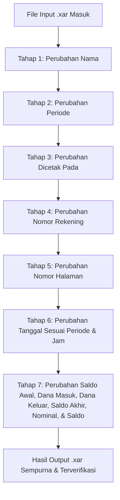

# MASTER SOP PROJECT V2: AI Agent Asisten Pengeditan Dokumen Xara (.xar)

Document Version: 1.0 (Project V2 Official Standard)  
Status: Permanent Master Standard Operating Procedure  
Environment: Xara Designer Pro+ Binary Format (`.xar`)  

---

## I. VISI UTAMA & PRINSIP DASAR KINERJA AGENT

1. **Tujuan Utama**: Membangun Asisten AI Agent untuk meningkatkan produktivitas pengolahan dokumen e-Statement/PDF secara presisi dan konsisten.
2. **Kelebihan Format Xara (`.xar`)**: Pengeditan dilakukan melalui file biner `.xar` karena Xara mampu **menyunting teks menggunakan font yang bahkan TIDAK TERINSTALL di Windows**, dengan tetap menghasilkan bentuk font, style, warna, dan ukuran yang 100% konsisten visualnya.
3. **PRINSIP WAJIB EKSEKUSI**: **Perubahan WAJIB dilakukan SATU-PER-SATU secara berurutan per-tahap** demi mencegah error dan menjamin stabilitas biner dokumen.

---

## II. ALUR PROSEDUR PENGEDITAN 7 TAHAP

### **TAHAP 1: Perubahan Nama**
* **Target**: Mengubah nama nasabah/pemilik rekening (`Nama/Name`) pada seluruh halaman.
* **Aturan**: Eksekusi khusus nama saja, tanpa menyentuh field lain.

### **TAHAP 2: Perubahan Periode**
* **Target**: Mengubah rentang tanggal laporan (`Periode/Period`) pada seluruh halaman header (contoh: `01 Jan 2026 - 31 Jan 2026`).

### **TAHAP 3: Perubahan Dicetak Pada**
* **Target**: Mengubah tanggal penerbitan dokumen (`Dicetak pada/Issued on`).

### **TAHAP 4: Perubahan Nomor Rekening**
* **Target**: Mengubah nomor rekening nasabah (`Nomor Rekening/Account Number`).

### **TAHAP 5: Perubahan Nomor Halaman**
* **Target**: Mengubah penomoran halaman dinamis (`Page X of Y` / `X dari Y`).

### **TAHAP 6: Perubahan Tanggal Sesuai Periode & Jam**
* **Target**: Mengubah tanggal transaksi (disesuaikan dengan periode) dan timestamp jam (`HH:MM:SS WIB`) pada setiap baris transaksi.

### **TAHAP 7: Perubahan Ringkasan & Tabel Transaksi Utama**
* **Target**: Mengubah data angka dan saldo secara utuh berdasarkan tabel input yang diberikan user:
  1. **Saldo Awal / Initial Balance**
  2. **Dana Masuk / Incoming Transactions**
  3. **Dana Keluar / Outgoing Transactions**
  4. **Saldo Akhir / Closing Balance**
  5. **Nominal Kredit (`+`) / Debit (`-`) tiap baris**
  6. **Saldo Akhir Berjalan (*Running Balance*) tiap baris**

---

## III. ATURAN PENERAPAN BINER & UKURAN PAYLOAD

Saat melakukan pengubahan teks pada setiap tahap di atas:
* **Auto-Size Sync**: Nilai header record biner `rec["size"]` **WAJIB selalu disinkronkan** dengan `len(rec["payload"])` agar tidak memicu `A read error occurred (streaming error)` di Xara.
* **Font Definition Lock**: `Tag 2907` pada node definisi font dilarang diubah agar embedded font bawaan dokumen tidak ter-reset.
