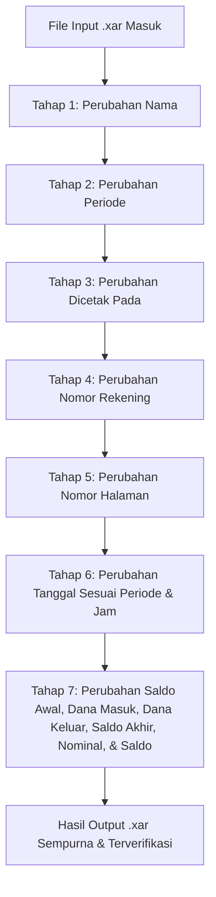

# MASTER SOP PROJECT V2: AI Agent Asisten Pengeditan Dokumen Xara (.xar)

Document Version: 1.0 (Project V2 Official Standard)  
Status: Permanent Master Standard Operating Procedure  
Environment: Xara Designer Pro+ Binary Format (`.xar`)  

---

## I. VISI UTAMA & PRINSIP DASAR KINERJA AGENT

1. **Tujuan Utama**: Membangun Asisten AI Agent untuk meningkatkan produktivitas pengolahan dokumen e-Statement/PDF secara presisi dan konsisten.
2. **Kelebihan Format Xara (`.xar`)**: Pengeditan dilakukan melalui file biner `.xar` karena Xara mampu **menyunting teks menggunakan font yang bahkan TIDAK TERINSTALL di Windows**, dengan tetap menghasilkan bentuk font, style, warna, dan ukuran yang 100% konsisten visualnya.
3. **PRINSIP WAJIB EKSEKUSI**: **Perubahan WAJIB dilakukan SATU-PER-SATU secara berurutan per-tahap** demi mencegah error dan menjamin stabilitas biner dokumen.

---

## II. ALUR PROSEDUR PENGEDITAN 7 TAHAP

### **TAHAP 1: Perubahan Nama**
* **Target**: Mengubah nama nasabah/pemilik rekening (`Nama/Name`) pada seluruh halaman.
* **Standar Layout & Format**:
  - String Nama **WAJIB** diakhiri dengan spasi dan newline `\r\n` (contoh: `f"{NAMA_BARU} \r\n"`).
  - Mekanisme ini mengaktifkan line-break internal pada text story container Xara, memindahkan **Nama ke Baris 1 (Atas)** dan **Cabang ke Baris 2 (Bawah)**.
  - Tag Kerning 2206 setelah record Nama di-set `Kern X = 0` agar alignment Cabang di baris 2 pas dan konsisten.
* **Aturan**: Eksekusi khusus nama saja, tanpa menyentuh field lain.

### **TAHAP 2: Perubahan Periode**
* **Target**: Mengubah rentang tanggal laporan (`Periode/Period`) pada seluruh halaman header (contoh: `01 Dec 2026 - 31 Dec 2026`).
* **Standar Layout & Node Structure**:
  - String periode header terpisah menjadi 4 record node biner per halaman:
    1. **Bulan/Tahun Awal + Separator**: `"[MMM YYYY] - "` (Halaman 1: Rec 01022, Halaman 2: Rec 03988)
    2. **Digit Puluhan Tanggal Akhir**: `"[D]"` (Halaman 1: Rec 01023, Halaman 2: Rec 03989)
    3. **Digit Satuan Tanggal Akhir + Spasi**: `"[D] "` (Halaman 1: Rec 01028, Halaman 2: Rec 03994)
    4. **Bulan/Tahun Akhir**: `"[MMM YYYY]"` (Halaman 1: Rec 01033, Halaman 2: Rec 03999)
  - **Sinkronisasi Otomatis**: Pengubahan bulan wajib menghitung otomatis jumlah hari dalam bulan tersebut (contoh: Dec = 31 hari) dan memperbarui ke-8 record node tersebut secara bersamaan.
* **Aturan**: Eksekusi khusus periode header saja, tanggal transaksi tabel dikerjakan di Tahap 6.

### **TAHAP 3: Perubahan Dicetak Pada**
* **Target**: Mengubah tanggal penerbitan dokumen (`Dicetak pada/Issued on`) pada seluruh halaman.
* **Standar Layout & Node Structure**:
  - String tanggal cetak terpisah menjadi 2 record node biner per halaman:
    1. **Tanggal & Bulan + Trailing Space**: `"[DD MMM ]"` (Halaman 1: Rec 03222, Halaman 2: Rec 06281)
    2. **Tahun 4 Digit**: `"[YYYY]"` (Halaman 1: Rec 03227, Halaman 2: Rec 06286)
  - **Sinkronisasi**: Pengubahan tanggal cetak wajib meng-update ke-4 node tersebut secara bersamaan pada seluruh halaman.

### **TAHAP 4: Perubahan Nomor Rekening**
* **Target**: Mengubah nomor rekening nasabah (`Nomor Rekening/Account Number`) pada header dokumen.
* **Standar Layout & Node Structure**:
  - Nomor Rekening berada secara eksklusif pada Header Halaman 1 (`Rec 01054`).
  - **Trailing Space Mandatory**: String nomor rekening **WAJIB** mempertahankan spasi penutup `f"{NOMOR_REKENING} "` agar kerning dan spacing header tetap presisi.
* **Aturan**: Eksekusi khusus nomor rekening saja.

### **TAHAP 5: Perubahan Nomor Halaman**
* **Target**: Mengubah penomoran halaman dinamis (`Page X of Y` / `X dari Y`) pada Header dan Footer seluruh halaman.
* **Standar Layout & Node Structure (Sinkronisasi 4 Node Wajib)**:
  1. **Page 1 Header**: `Rec 01278` -> `f"ari {TOTAL_PAGES}"` (membentuk `1 dari Y`)
  2. **Page 1 Footer**: `Rec 01125` -> `f"1 of {TOTAL_PAGES}"` (membentuk `1 of Y`)
  3. **Page 2 Header**: `Rec 04080` -> `f"ari {TOTAL_PAGES}"` (membentuk `2 dari Y`)
  4. **Page 2 Footer**: `Rec 04033` -> `f"of {TOTAL_PAGES}"` (membentuk `2 of Y` dipasangkan dengan `Rec 04025`)
* **Rule Mandatory**: Perubahan total halaman **WAJIB** meng-update ke-4 node tersebut sekaligus agar Header (`X dari Y`) dan Footer (`X of Y`) 100% sinkron secara visual.

### **TAHAP 6: Perubahan Tanggal Sesuai Periode & Jam**
* **Target**: Mengubah tanggal transaksi (disesuaikan dengan periode header) dan timestamp jam (`HH:MM:SS WIB`) pada setiap baris transaksi tabel.
* **Standar Layout & Format**:
  - **Period Matching Mandatory**: Seluruh tanggal baris transaksi **WAJIB** berada dalam rentang bulan & tahun periode yang dikunci di Tahap 2 (contoh: `Dec 2026`).
  - **24-Hour Time Format Mandatory**: Format timestamp jam **WAJIB** menggunakan sistem 24 jam dengan 2-digit jam (`HH:MM:SS WIB`, contoh: `04:00:00 WIB` atau `01:20:13 WIB`). Jam 1-digit dilarang (`1:20:13` ➡️ `01:20:13`).
  - **Pengujian Baris Spesifik**: Pengubahan baris tertentu (contoh: Baris 10 `25 Dec 2026 04:00:00`) dilakukan langsung pada record date & time pasangan baris tersebut tanpa merusak kerning baris lain.

### **TAHAP 7: Perubahan Ringkasan & Tabel Transaksi Utama**
* **Target**: Mengubah data angka dan saldo secara utuh berdasarkan tabel input yang diberikan user:
  1. **Saldo Awal / Initial Balance**
  2. **Dana Masuk / Incoming Transactions**
  3. **Dana Keluar / Outgoing Transactions**
  4. **Saldo Akhir / Closing Balance**
  5. **Nominal Kredit (`+`) / Debit (`-`) tiap baris**
  6. **Saldo Akhir Berjalan (*Running Balance*) tiap baris**

---

## III. ATURAN PENERAPAN BINER & UKURAN PAYLOAD

Saat melakukan pengubahan teks pada setiap tahap di atas:
* **Auto-Size Sync**: Nilai header record biner `rec["size"]` **WAJIB selalu disinkronkan** dengan `len(rec["payload"])` agar tidak memicu `A read error occurred (streaming error)` di Xara.
* **Font Definition Lock**: `Tag 2907` pada node definisi font dilarang diubah agar embedded font bawaan dokumen tidak ter-reset.
