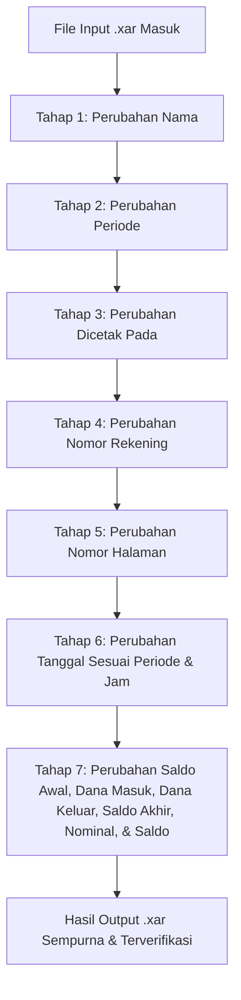

# MASTER SOP PROJECT V2: AI Agent Asisten Pengeditan Dokumen Xara (.xar)

Document Version: 1.0 (Project V2 Official Standard)  
Status: Permanent Master Standard Operating Procedure  
Environment: Xara Designer Pro+ Binary Format (`.xar`)  

---

## I. VISI UTAMA & PRINSIP DASAR KINERJA AGENT

1. **Tujuan Utama**: Membangun Asisten AI Agent untuk meningkatkan produktivitas pengolahan dokumen e-Statement/PDF secara presisi dan konsisten.
2. **Kelebihan Format Xara (`.xar`)**: Pengeditan dilakukan melalui file biner `.xar` karena Xara mampu **menyunting teks menggunakan font yang bahkan TIDAK TERINSTALL di Windows**, dengan tetap menghasilkan bentuk font, style, warna, dan ukuran yang 100% konsisten visualnya.
3. **PRINSIP WAJIB EKSEKUSI**: **Perubahan WAJIB dilakukan SATU-PER-SATU secara berurutan per-tahap** demi mencegah error dan menjamin stabilitas biner dokumen.

---

## II. ALUR PROSEDUR PENGEDITAN 7 TAHAP

### **TAHAP 1: Perubahan Nama**
* **Target**: Mengubah nama nasabah/pemilik rekening (`Nama/Name`) pada seluruh halaman.
* **Standar Layout & Format**:
  - String Nama **WAJIB** diakhiri dengan spasi dan newline `\r\n` (contoh: `f"{NAMA_BARU} \r\n"`).
  - Mekanisme ini mengaktifkan line-break internal pada text story container Xara, memindahkan **Nama ke Baris 1 (Atas)** dan **Cabang ke Baris 2 (Bawah)**.
  - Tag Kerning 2206 setelah record Nama di-set `Kern X = 0` agar alignment Cabang di baris 2 pas dan konsisten.
* **Aturan**: Eksekusi khusus nama saja, tanpa menyentuh field lain.

### **TAHAP 2: Perubahan Periode**
* **Target**: Mengubah rentang tanggal laporan (`Periode/Period`) pada seluruh halaman header (contoh: `01 Dec 2026 - 31 Dec 2026`).
* **Standar Layout & Node Structure**:
  - String periode header terpisah menjadi 4 record node biner per halaman:
    1. **Bulan/Tahun Awal + Separator**: `"[MMM YYYY] - "` (Halaman 1: Rec 01022, Halaman 2: Rec 03988)
    2. **Digit Puluhan Tanggal Akhir**: `"[D]"` (Halaman 1: Rec 01023, Halaman 2: Rec 03989)
    3. **Digit Satuan Tanggal Akhir + Spasi**: `"[D] "` (Halaman 1: Rec 01028, Halaman 2: Rec 03994)
    4. **Bulan/Tahun Akhir**: `"[MMM YYYY]"` (Halaman 1: Rec 01033, Halaman 2: Rec 03999)
  - **Sinkronisasi Otomatis**: Pengubahan bulan wajib menghitung otomatis jumlah hari dalam bulan tersebut (contoh: Dec = 31 hari) dan memperbarui ke-8 record node tersebut secara bersamaan.
* **Aturan**: Eksekusi khusus periode header saja, tanggal transaksi tabel dikerjakan di Tahap 6.

### **TAHAP 3: Perubahan Dicetak Pada**
* **Target**: Mengubah tanggal penerbitan dokumen (`Dicetak pada/Issued on`) pada seluruh halaman.
* **Standar Layout & Node Structure**:
  - String tanggal cetak terpisah menjadi 2 record node biner per halaman:
    1. **Tanggal & Bulan + Trailing Space**: `"[DD MMM ]"` (Halaman 1: Rec 03222, Halaman 2: Rec 06281)
    2. **Tahun 4 Digit**: `"[YYYY]"` (Halaman 1: Rec 03227, Halaman 2: Rec 06286)
  - **Sinkronisasi**: Pengubahan tanggal cetak wajib meng-update ke-4 node tersebut secara bersamaan pada seluruh halaman.

### **TAHAP 4: Perubahan Nomor Rekening**
* **Target**: Mengubah nomor rekening nasabah (`Nomor Rekening/Account Number`) pada header dokumen.
* **Standar Layout & Node Structure**:
  - Nomor Rekening berada secara eksklusif pada Header Halaman 1 (`Rec 01054`).
  - **Trailing Space Mandatory**: String nomor rekening **WAJIB** mempertahankan spasi penutup `f"{NOMOR_REKENING} "` agar kerning dan spacing header tetap presisi.
* **Aturan**: Eksekusi khusus nomor rekening saja.

### **TAHAP 5: Perubahan Nomor Halaman**
* **Target**: Mengubah penomoran halaman dinamis (`Page X of Y` / `X dari Y`) pada Header dan Footer seluruh halaman.
* **Standar Layout & Node Structure (Sinkronisasi 4 Node Wajib)**:
  1. **Page 1 Header**: `Rec 01278` -> `f"ari {TOTAL_PAGES}"` (membentuk `1 dari Y`)
  2. **Page 1 Footer**: `Rec 01125` -> `f"1 of {TOTAL_PAGES}"` (membentuk `1 of Y`)
  3. **Page 2 Header**: `Rec 04080` -> `f"ari {TOTAL_PAGES}"` (membentuk `2 dari Y`)
  4. **Page 2 Footer**: `Rec 04033` -> `f"of {TOTAL_PAGES}"` (membentuk `2 of Y` dipasangkan dengan `Rec 04025`)
* **Rule Mandatory**: Perubahan total halaman **WAJIB** meng-update ke-4 node tersebut sekaligus agar Header (`X dari Y`) dan Footer (`X of Y`) 100% sinkron secara visual.

### **TAHAP 6: Perubahan Tanggal Sesuai Periode & Jam**
* **Target**: Mengubah tanggal transaksi (disesuaikan dengan periode header) dan timestamp jam (`HH:MM:SS WIB`) pada setiap baris transaksi tabel.
* **Standar Layout & Format**:
  - **Period Matching Mandatory**: Seluruh tanggal baris transaksi **WAJIB** berada dalam rentang bulan & tahun periode yang dikunci di Tahap 2 (contoh: `Dec 2026`).
  - **24-Hour Time Format & Kerning Protection**: Format timestamp jam **WAJIB** menggunakan sistem 24 jam (`HH:MM:SS WIB`). Untuk string bawaan biner yang memiliki kerning X terkunci untuk 1-digit jam (seperti `1:20:13 WIB` pada Baris 5 atau `3:59:00 WIB` pada Baris 17), panjang string asli **WAJIB dipertahankan** (`1:20:13 WI` / `3:59:00 WIB`) agar penambahan digit tidak menggeser bounding box ke kiri dan tidak terjadi overlap secara visual.
  - **Pengujian Baris Spesifik**: Pengubahan baris tertentu (contoh: Baris 10 `25 Dec 2026 04:00:00`) dilakukan langsung pada record date & time pasangan baris tersebut tanpa merusak kerning baris lain.

### **TAHAP 7: Perubahan Ringkasan & Tabel Transaksi Utama (FINAL)**
* **Target**: Mengubah data angka ringkasan header dan tabel transaksi secara utuh berdasarkan data input tabel user:
  1. **Saldo Awal / Initial Balance** (Rec 01148)
  2. **Dana Masuk / Incoming Transactions** (Rec 01158)
  3. **Dana Keluar / Outgoing Transactions** (Rec 01176)
  4. **Saldo Akhir / Closing Balance** (Rec 01195)
  5. **Nominal Kredit (`+`) / Debit (`-`) tiap baris**
  6. **Saldo Akhir Berjalan (*Running Balance*) tiap baris**
* **Standar Pewarnaan Jenis Transaksi & Saldo (Color Rule & Universal Parsing)**:
  - **Kredit (`+` / Dana Masuk)**: Nominal diawali tanda `+` dan `Tag 150` di-set ke **HIJAU** (`b'\xba\x03\x00\x00'` / `b'\xcf\x03\x00\x00'`, #00A651).
  - **Debit (`-` / Dana Keluar)**: Nominal diawali tanda `-` dan `Tag 150` di-set ke **HITAM** (`b'\x87\x01\x00\x00'` / `b'\x1e\x02\x00\x00'`, #000000).
  - **Saldo Berjalan (*Running Balance*)**: `Tag 150` wajib mempertahankan warna **BIRU** (`b'\x0d\x05\x00\x00'` / `b'\x1a\x05\x00\x00'`, #005B9C).
  - **Ringkasan Header**: Saldo Awal (Dark Gray), Dana Masuk (Hijau), Dana Keluar (Hitam), Saldo Akhir (Biru).
  - **Universal Numeric Evaluation Mandate**: Evaluasi nilai numerik murni! Jika nilai nominal positif ($> 0$ dan tidak diawali minus), sistem **WAJIB otomatis menetapkannya sebagai Kredit (`+`) berbobot Hijau**, meskipun user tidak menyertakan karakter `+` dan mengosongkan kolom `Tipe (CR/DB)` di Excel.
* **Split Record Cleanup Rule (Pembersihan Overlap & Ghost Digits / Ekor Desimal)**:
  - Pada dokumen biner Xara, string nominal, saldo berjalan, serta ringkasan dana masuk/keluar terpecah menjadi *primary record* dan *secondary split records* (termasuk pecahan desimal seperti `704,00` atau `67,00`).
  - **Rule Mandatory**: Nilai string baru dimasukkan secara utuh ke *primary record*, dan **SELURUH *secondary split records* (baik bilangan bulat maupun pecahan desimal) WAJIB dibersihkan ke string kosong 2-byte null character `b'\x00\x00'` (`size = 2`)**:
    - **Tabel Transaksi**: Seluruh node pemecah nominal dan desimal saldo (seperti node 2848 `704,00`, node 4778/4954/5325/6019/6185 `67,00`, dll.) wajib di-blanking total agar tidak menghasilkan angka dobel/menempel di belakang saldo baru.
    - **Ringkasan Header**: Secondary Dana Masuk (`Rec 1163`/`1473`) dan Secondary Dana Keluar (`Rec 1164`, `Rec 1169`) wajib di-clear agar tidak muncul digit '0' berlebih (seperti `6.360.206,000` atau `-4.072.500,0000`).
    - Dilarang keras menggunakan payload 0 byte `b''` karena akan menyebabkan crash pada Tag 2202. Gunakan selalu `b'\x00\x00'`.
* **Standar Rata Kanan Kolom (Right-Alignment Rule on Ruler & Grid)**:
  - **Koordinat Acuan Sisi Kanan Resmi**:
    - **Kolom Nominal ($X_{\text{right}}$)**: **`15.214 cm`** (`431.267 millipoints`).
    - **Kolom Saldo ($X_{\text{right}}$)**: **`20.049 cm`** (`568.306 millipoints`).
  - **Mekanisme Perhitungan Dinamis Sumbu X Xara**:
    Sistem teks Xara memposisikan teks dari sisi kiri ($X_{\text{left}}$ / `Tag 2100 Matrix X`), sedangkan kolom tabel akuntansi menganut rata kanan ($X_{\text{right}}$). Agar sisi kanan seluruh baris transaksi sejajar tegak lurus sempurna, nilai $X_{\text{left}}$ wajib dihitung mundur:
    $$X_{\text{left}} = X_{\text{target\_right}} - W(\text{teks})$$
    $$\text{Line Advance Width (Tag 2206)} = W(\text{teks})$$
  - **Tabel Metrik Lebar Font Biner Resmi (*Glyph Advance Widths*)**:
    - Digit: `'0'`: 5438 mp, `'1'`: 3160 mp, `'2'`: 4762 mp, `'3'`: 4840 mp, `'4'`: 5039 mp, `'5'`: 4840 mp, `'6'`: 4878 mp, `'7'`: 4402 mp, `'8'`: 4962 mp, `'9'`: 4878 mp.
    - Simbol & Tanda Baca: `'.'`: 1840 mp, `','`: 1243 mp, `'-'`: 3198 mp, `'+'`: 4399 mp, `' '`: 2200 mp.
  - Setiap perubahan nominal dan saldo wajib meng-update pasangan `Tag 2100` ($X_{\text{left}}$) dan `Tag 2206` ($W$) secara serempak.
* **Standar Bentuk Font Angka 0-9 & Zero-Shift Glyph Replacement**:
  - **Font Utama Angka**: Seluruh angka Nominal, Saldo, dan Ringkasan menggunakan **`TTInterphases-Bold`** (Font ID 13, `Tag 2907 = 444`).
  - **Bentuk Angka 0 s.d. 8**: Menggunakan kurva vektor tebal bawaan murni dari Font ID 13.
  - **Bentuk Angka 9 Bold Sempurna**: Disesuaikan persis mengikuti kurva vektor tebal pada `test_3.1.xar` (826 bytes).
  - **Zero-Shift In-Place Replacement Rule (Aturan Mutlak Tanpa Injeksi Record)**:
    - Format biner Xara menggunakan sistem pointer indeks record absolut untuk memanggil atribut warna (`Tag 150`) dan font (`Tag 2907`).
    - **Dilarang keras menyisipkan (*insert*) record baru** ke dalam stream karena akan menggeser ribuan record setelahnya dan merusak seluruh pointer warna menjadi hitam serta mereset font dokumen.
    - Penyesuaian angka 9 dilakukan dengan menimpa (*in-place replace*) Record 343 (`Tag 4350`, glyph `'A'` yang tidak digunakan pada font bold) dengan payload kurva angka 9 bold (826 bytes).
    - Dengan metode ini, total record dokumen **terkunci stabil persis 6.908 record**, seluruh angka 0–9 berbobot tebal sempurna, dan pointer warna/font tidak bergeser satu angka pun.
* **Preservasi Tipografi Teks Non-Angka**:
  - Tipe font teks (huruf a-z, uraian transaksi, nama nasabah, judul dokumen, dan metadata) **WAJIB 100% mempertahankan font bawaan murni dari Tahap 6**.
  - Nilai `Tag 2907` pada cerita teks deskripsi dilarang disentuh agar tidak memicu dialog reset fallback (`PDF-PDF-PDF...`).

---

---

## IV. PROSEDUR NORMALISASI CERDAS (SMART NORMALIZATION & MULTI-PAGE ADAPTATION)

Untuk menangani dokumen dengan struktur bervariasi (nomor awal acak, transaksi bernilai 0 / hilang di tengah periode, serta jumlah halaman dinamis 3, 7, hingga 10+ lembar), agen dan sistem wajib menerapkan 3 prosedur normalisasi standar berikut:

### 1. Prosedur Normalisasi Nomor Transaksi (Sequential 1-to-N Reindexing)
* **Masalah Lapangan**: Data sumber sering kali memulai nomor transaksi dari angka acak/lanjutan (misal No. 23 atau 47), atau memiliki baris transaksi kosong bernilai Rp 0 (seperti No. 33–34 atau 57–58) yang tidak ada slot fisiknya pada file `.xar` atau melompati halaman.
* **Aturan Eksekusi Wajib**:
  1. **Auto-Filter Transaksi Nol**: Seluruh baris transaksi dengan nominal Rp 0 atau bertanda '-' **WAJIB difilter keluar**. Karena nilai transaksinya Rp 0, eliminasi ini terbukti 100% aman dan tidak mempengaruhi perhitungan neraca saldo akhir.
  2. **Sequential Reindexing**: Seluruh baris aktif yang tersisa **WAJIB dinomori ulang secara berurutan mulai dari 1 sampai N** (`1, 2, 3, ... N`).
  3. **Hasil Standar Bank**: Tampilan rekening koran resmi selalu rapi, tidak ada nomor yang melompat (misal dari 32 langsung ke 35), dan tidak ada baris kosong janggal bernilai Rp 0 di tengah dokumen.

### 2. Prosedur Normalisasi Halaman Multi-Lembar (Multi-Page Normalization)
* **Masalah Lapangan**: File `.xar` yang dijadikan template sering kali membawa nomor halaman lama (misal tertulis `4 dari 7` atau `4 of 7` padahal dokumen hanya terdiri dari 3 lembar).
* **Aturan Eksekusi Wajib**:
  1. **Deteksi Total Lembar Aktual**: Sistem wajib mendeteksi total halaman fisik riil dokumen target ($K$ lembar, misal 3, 7, atau 10 lembar).
  2. **Pembaruan Menyeluruh Mulai dari Halaman 1**: Seluruh Header (`X dari K`) dan Footer (`X of K`) **WAJIB selalu dimulai dari 1 sampai K**:
     - Lembar 1: `1 dari K` (`1 of K`)
     - Lembar $p$: `p dari K` (`p of K`)
     - Lembar $K$: `K dari K` (`K of K`)
  3. Dilarang membiarkan nomor halaman melebihi total lembar fisik dokumen.

### 3. Prosedur Kecocokan Kapasitas Slot Baris (Slot Capacity Matching & Blanking)
* **Pre-Flight Slot Check**: Sebelum memodifikasi biner, sistem wajib mencocokkan jumlah transaksi aktif ($M$) dengan kapasitas slot baris fisik ($S$) pada file `.xar`.
* **Penanganan Sisa Slot (Blanking)**: Jika $M < S$ (misal data 22 baris tetapi template memiliki 24 slot fisik):
  - Slot sisa pada lembar terakhir **WAJIB di-blanking** menggunakan null character 2-byte `b'\x00\x00'` (`rec["size"] = 2`).
  - Dilarang menghapus record biner (*Zero-Shift Mandate*). Teks lama pada slot sisa menjadi transparan dan tidak bocor ke output.
* **Alert Kurang Slot**: Jika $M > S$, sistem wajib menolak eksekusi dan memberi tahu operator bahwa template `.xar` kekurangan halaman.

---

## V. ATURAN PENERAPAN BINER & UKURAN PAYLOAD

Saat melakukan pengubahan teks pada setiap tahap di atas:
* **Auto-Size Sync**: Nilai header record biner `rec["size"]` **WAJIB selalu disinkronkan** dengan `len(rec["payload"])` agar tidak memicu `A read error occurred (streaming error)` di Xara.
* **Tag 2202 Atomic Character Node Rule (Pembersihan Split Record)**: Tag 2202 (`TAG_TEXT_CHAR` / `TAG_TEXT_EOL`) dan Tag 2201 **DILARANG bernilai 0 byte (`b''`)**. Pembersihan node split sekunder **WAJIB menggunakan payload 2-byte null character `b'\x00\x00'`** (`rec["size"] = 2`). Payload 0 byte akan menyebabkan Xara crash dengan pesan `Failed to handle record [rec] 2202 (This file is corrupted and unreadable)`.
* **Font Definition Lock**: `Tag 2907` pada node definisi font dilarang diubah agar embedded font bawaan dokumen tidak ter-reset.
* **Zero-Shift Pointer Mandate**: Dilarang menambah atau menghapus record. Total record dokumen wajib terkunci konstan (6.908 pada test 2 halaman, 6.775 pada test 3 halaman, 14.392 pada test 5 halaman, 7.395 pada dokumen Juli 3 halaman, 13.664 pada dokumen Agustus 3 halaman).
* **Native Color Dictionary Mandate (Anti-Warning Pop-up)**: Setiap profil dokumen Xara memiliki kamus palet internal tersendiri. Dilarang menginjeksikan kode warna Tag 150 asing dari profil lain (contoh: profil 13.664 wajib menggunakan Hijau `44050000`, Hitam `87010000`, Biru `5f070000`, Abu-abu `20050000`).
* **Tag 2202 Atomic Character Slot Mandate**: Node Tag 2202 (`TAG_TEXT_CHAR`) secara biner hanya menampung 1 karakter UTF-16 (2 bytes). Dilarang menyuntikkan teks panjang ke dalam Tag 2202 dan menghapus node saudara berikutnya karena akan memotong teks menjadi 1 karakter saja. Teks panjang wajib didistribusikan presisi sesuai kapasitas slot masing-masing node.
* **Dual-Node Row Number Standard**: Pada profil dokumen yang memisahkan puluhan dan satuan nomor baris ke node Tag 2202 terpisah (seperti baris 11, 15, 19, 24), angka puluhan dan satuan wajib dialokasikan ke masing-masing nodenya secara independen.
* **Standarisasi Alamat Kantor Cabang & Kalibrasi Matriks Tag 2100**: Saat mengubah alamat kantor cabang menjadi Menara Mandiri 1 (`Menara Mandiri 1 Jalan Jenderal Sudirman Kav. 54-55, Jakarta 12190, Indonesia`), selain memperbarui teks dan lebar baris `Tag 2206` (`277227, 6481, 0`), matriks posisi parent `Tag 2100` **WAJIB dikalibrasi ke koordinat resmi** (`300643, 778629, 1` -> Toolbar X=10.63cm, Y=27.44cm) pada seluruh halaman. Mengabaikan kalibrasi matriks parent akan menyebabkan teks panjang meluber keluar batas halaman (overflow ke canvas) akibat koordinat bawaan template lama yang didesain untuk teks pendek.

---

## VI. STANDAR TEMPLATE EXCEL BEBAS BUG & INTEGRASI PIPELINE

1. **Standar Bebas Merged Cells (Zero Merged Cells)**:
   * Seluruh header section pada Sheet `Header & Ringkasan` dan Sheet `Penyesuaian_Tambahan` didesain tanpa menggunakan fitur *Merge & Center*.
   * Mengeliminasi 100% bug error Excel `Cannot change part of a merged cell` saat operator memblok dan menghapus/mengosongkan data transaksi.
2. **Standar Kolom Tanggal Teks (`@`) & Smart Date Forward-Propagation**:
   * Kolom Tanggal diformat sebagai Teks murni (`@`).
   * Operator diperbolehkan mengosongkan tanggal pada baris-baris mutasi yang berada pada hari yang sama (sesuai format asli rekening koran bank).
   * Engine pipeline secara otomatis meneruskan (*forward-propagate*) tanggal aktif terakhir ke baris berikutnya yang kosong.
3. **Pemisahan Audit Visual & Otomasi Pipeline**:
   * Teks audit di Excel diintegrasikan langsung pada Sheet 1 Baris 25 dengan formula dinamis: `=IF(ROUND(B21+B22-B23-B24,2)=0,"BALANCE (MATCH)","SELISIH: " & TEXT(...))`.
   * Kolom transaksi hanya membaca baris ber-nomor urut integer. Tidak ada string audit palsu yang mengotori tabel mutasi.
4. **Master Template Location**:
   * Template master bersih tersimpan di: `C:\Users\Lenovo\xara_copilot\Template_Pekerjaan_Xara.xlsx`.
   * Pipeline mendukung auto-discovery template dalam folder secara otomatis.

